# CQS visual surface atlas — MENUS pre-owner-gate

- **Archive:** `2026-09-menus-pre-owner-gate`
- **Implementation SHA:** `1404b517921a5182a57291b3d7df36d464245ee5`
- **Evidence class:** AUTOMATED-CAPTURE / BROWSER-RENDERED (unless noted)
- **Order:** ordinary teacher workflow, then edges / recovery / stress

```text
launch → Home (empty | populated | Resume)
  → Import templates / New Game board-first
  → Play → Class Setup (Names → Ready; optional Buzzers/Display/Sound)
  → Start Game → focused Host
  → (optional) More / Open display / Back to setup
  → Resume Welcome-back (setup | play)
```

---

## Application / Home

### MENUS-HOME-EMPTY — Empty Home

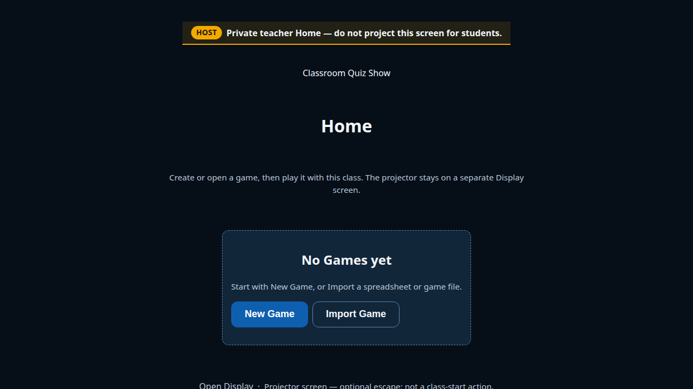

- **Why:** New Game dominant; Import adjacent; Display demoted; no Host CTA.
- **Also:** [`menus-home-empty-1366x768.png`](screenshots/app/menus-home-empty-1366x768.png)

### MENUS-HOME-POPULATED — Populated, no recovery

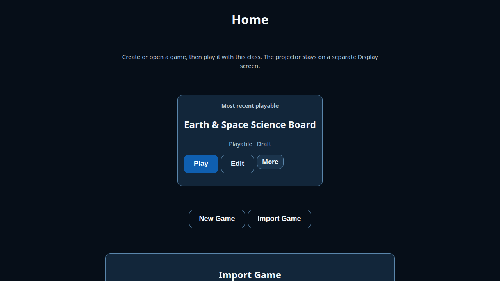

- **Why:** Featured playable hero; distinct from recovery-first Home.

### MENUS-HOME-RECOVERY — Resume dominates

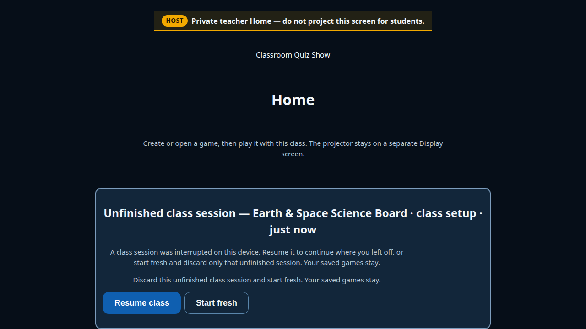

- **Why:** Resume class band owns attention; library subordinate.
- **Privacy:** Host-private recovery copy — never Display.

### MENUS-IMPORT-TEMPLATES — Import disclosure

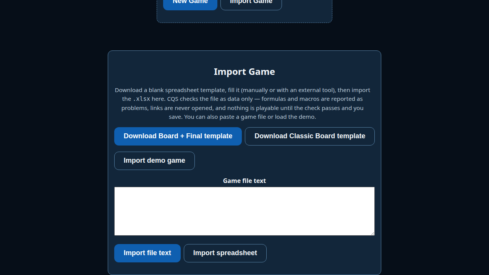

- **Why:** Board+Final primary / Classic secondary + formulas/macros safety.

---

## Authoring

### MENUS-AUTH-BOARD-FIRST — New Game board-first

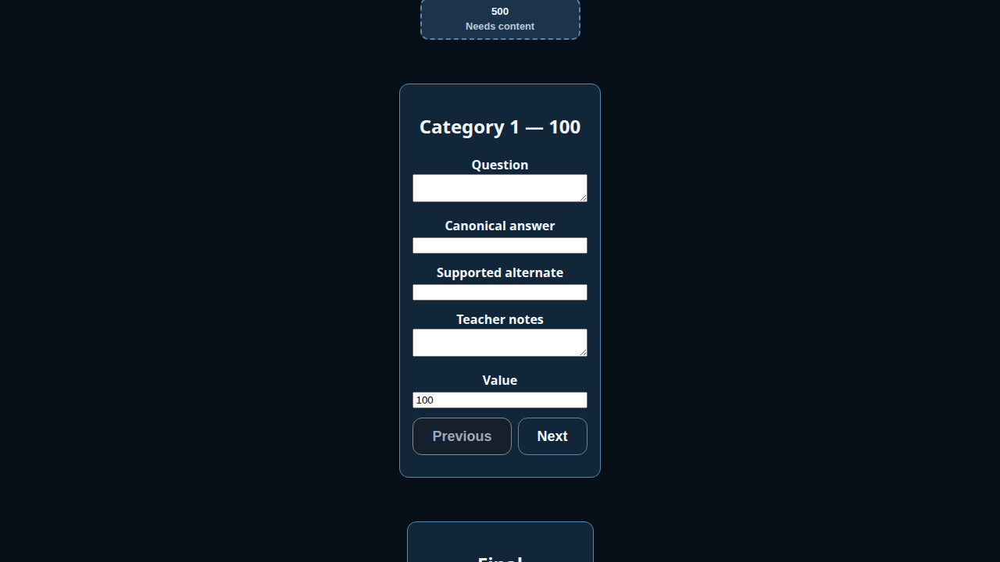

- **Why:** “Fill the board first”; tile editor; Game settings closed.

---

## Class Setup

### MENUS-SETUP-NAMES — Names active

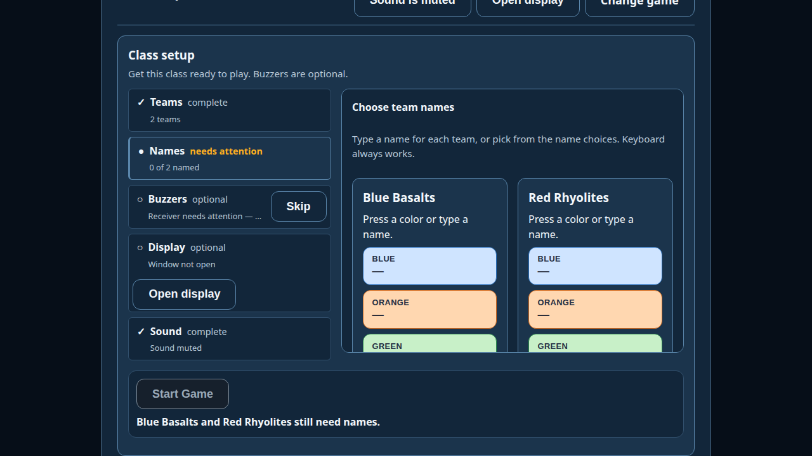

- **Why:** Needs attention; Start disabled; rail grammar before Ready.

### MENUS-SETUP-READY — Ready (plan H minimum)

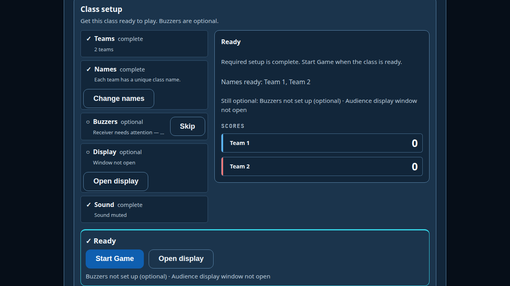

- **Why:** Ready heading; Start Game sole dominant; optionals unresolved OK.
- **Also:** [`1366`](screenshots/setup/menus-setup-ready-1366x768.png), [`sim125`](screenshots/setup/menus-setup-ready-1093x542-sim125.png)
- **sim125 note:** Natural first viewport (no scroll). Start Game strip may require
  scroll at this CSS box — honest crowding, not a scrolled “Start in frame” claim.

### MENUS-SETUP-READY-OPTIONAL-OPEN — Ready + Buzzers open

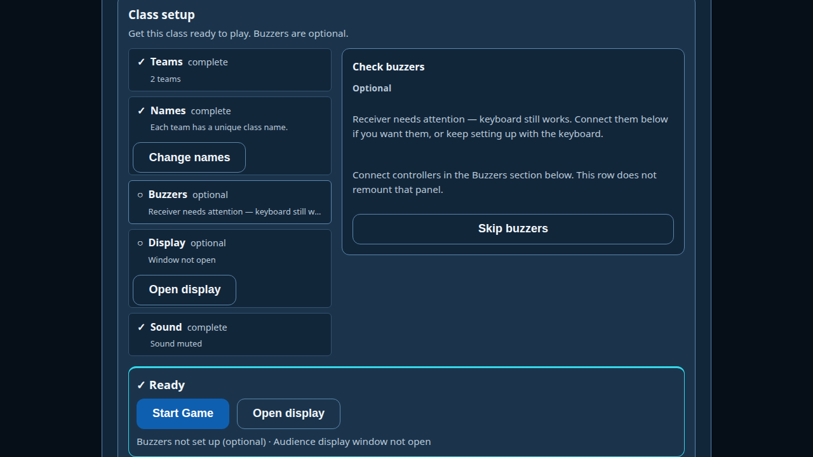

- **Why:** Open optional never demotes Start.

### MENUS-SETUP-0-TEAM — Blocked Teams

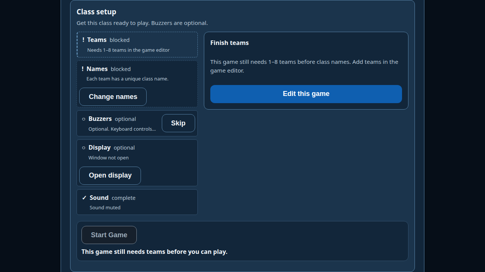

- **Why:** Fail-closed 0-team mount; Edit this game.

### MENUS-SETUP-EIGHT-NAMES — Eight-team stress

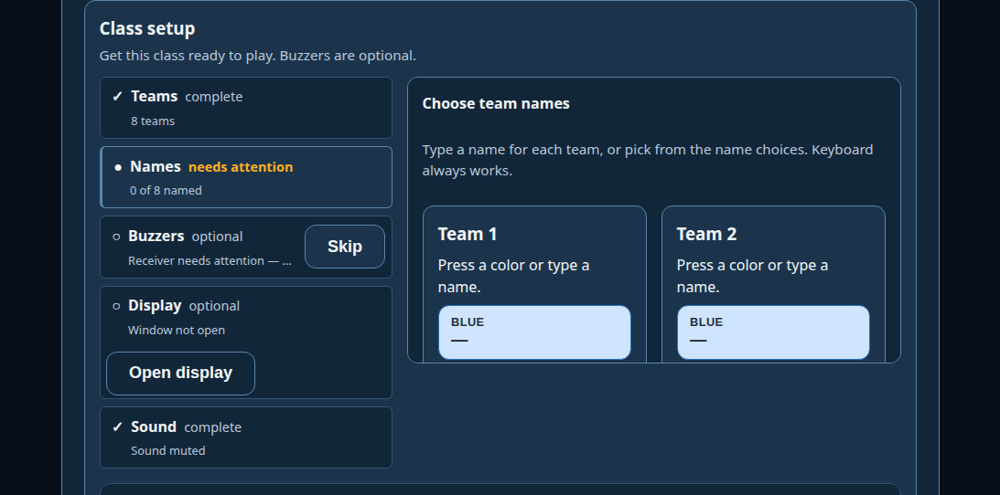

- **Why:** Compression under D04 sim125 CSS box (browser sim ≠ OS zoom).

---

## Focused Host

### MENUS-HOST-FOCUSED — Immediate post-Start (plan H minimum)

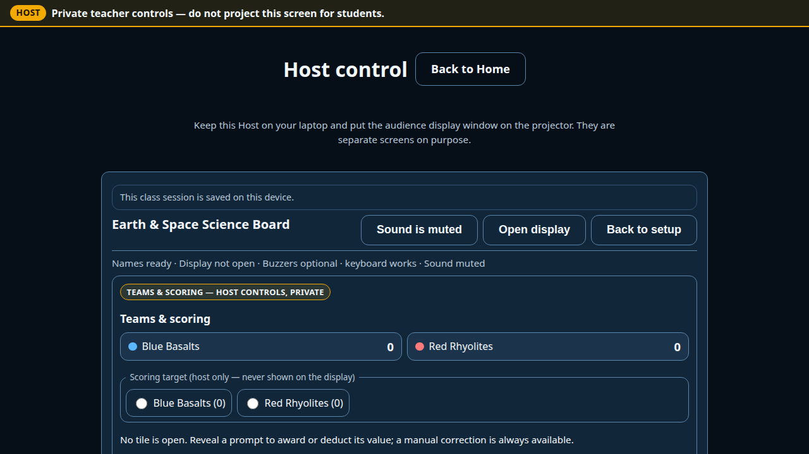

- **Why:** Setup rail gone; Back to setup; Mute / Display / More; `tsp-scoreboard`
  in natural first viewport after H-REPAIR-1; Controllers detail collapsed and after gameplay.
- **Also:** [`1366`](screenshots/host/menus-host-focused-1366x768.png), [`sim125`](screenshots/host/menus-host-focused-1093x542-sim125.png)
- **Capture:** Natural first viewport after Start (product scroll-to-top only; no `scrollIntoView`).

### MENUS-HOST-NO-DISPLAY — Display closed in play


- **Why:** Display never blocks Start / play.

### MENUS-HOST-MORE — More tray

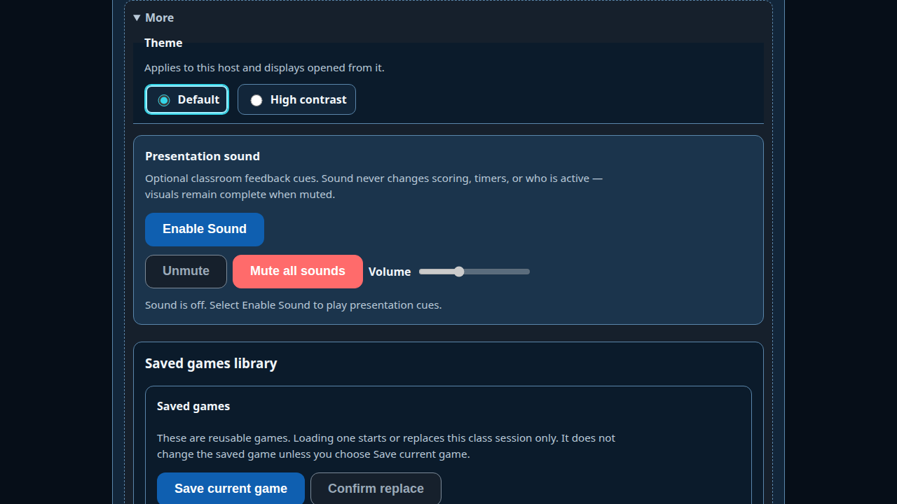

- **Why:** Reset / load-game demoted under More.

---

## Resume Welcome-back

### MENUS-RESUME-WELCOME-SETUP

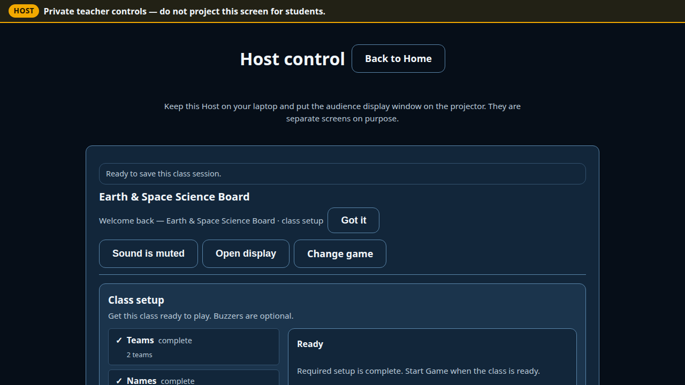

- **Privacy:** Host-private orientation — must not appear on Display/PublicState.

### MENUS-RESUME-WELCOME-PLAY

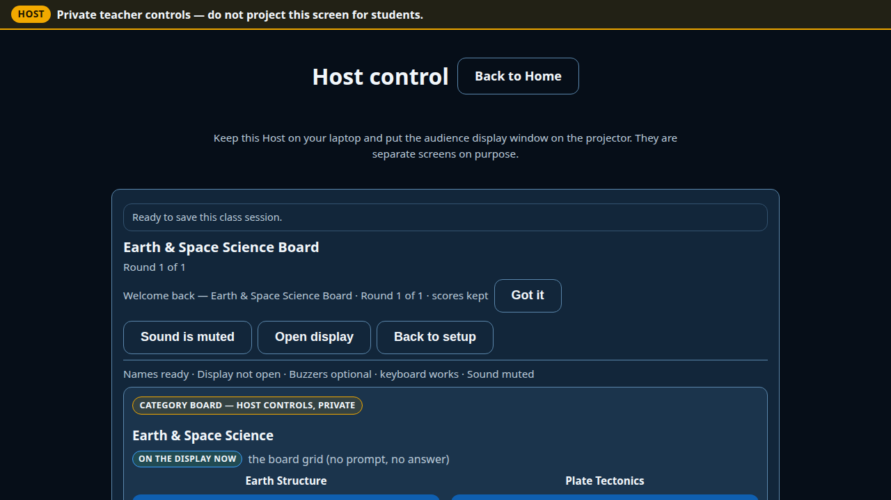

- **Why:** Distinct from cold focused Host (Welcome + scores kept / round).

---

## Pending / deferred (not in `screenshots/`)

See [`OWNER-CAPTURE-CHECKLIST.md`](OWNER-CAPTURE-CHECKLIST.md):

- Electron chrome · Sidecar · physical Sony · S06 Windows / projector / audio

## Human inspection notes (BROWSER/RENDERED)

Inspected automated PNGs for: correct state labels, hierarchy (dominant CTA),
no obvious clipping of Start/Ready strip at primary 1280, Host-private Welcome
copy only on Host shots, synthetic demo titles only, viewport labels match
filenames. **Not** owner acceptance. **Not** pixel-match to D04 prototype.
