# CQS Visual Surface Atlas — S05 complete / pre-owner-playthrough

- **Milestone:** S05 presentation children complete / pre-owner-playthrough
- **Canonical implementation SHA:** `4368cc9eeb7dbf3ef342926e1d0fba7ba4c10f9b`
- **Date (UTC):** 2026-09-24
- **S05 parent:** OPEN / NOT TERMINAL
- **Owner playthrough:** NOT RUN at baseline capture
- **Authority:** Visual historical record only — not implementation authority

Each entry records a materially distinct graphical surface or state.
Screenshot paths are relative to this archive folder.
Owner inspection remains required for human acceptance; automated
capture proves renderer output at this SHA, not classroom fitness.

## Summary

| Metric | Count |
| --- | ---: |
| Surfaces inventoried | 58 |
| Automated captures (PNG present) | 50 |
| Owner / local capture queue | 5 |
| Deferred to S06 | 3 |

## Application / startup

### `APP-HOME` — Home / launch

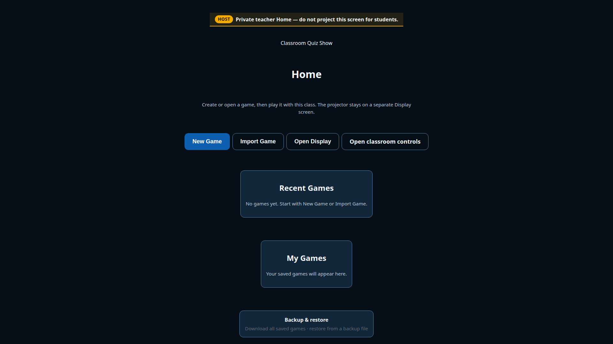

- **Screenshot:** `screenshots/app/app-home-1920x1080.png`
- **Role:** App
- **Class:** normal
- **Purpose:** Teacher entry: library, import, open classroom controls
- **Trigger / state:** Navigate to Home with empty local library
- **Components:** `HomeRoute`
- **Route:** #/
- **Privacy boundary:** shared-teacher
- **UX principles:** P01, P06, P20 (teacher concepts / terminology)
- **Capture resolution:** 1920x1080
- **Capture method:** AUTOMATED-CAPTURE
- **Canonical code SHA:** `4368cc9eeb7dbf3ef342926e1d0fba7ba4c10f9b`
- **Milestone:** S05 complete / pre-owner-playthrough
- **Date:** 2026-09-24
- **Owner inspection:** required
- **Known limitations:** Browser Chromium capture; not Electron/Windows/projector/Sidecar evidence.

### `APP-HOME-WITH-GAME` — Home after demo import

- **Screenshot:** `screenshots/app/app-home-with-game-1920x1080.png`
- **Role:** App
- **Class:** normal
- **Purpose:** Game library populated after successful import
- **Trigger / state:** Import demo game on Home
- **Components:** `HomeRoute`
- **Route:** #/
- **Privacy boundary:** shared-teacher
- **UX principles:** P01, P06, P20 (teacher concepts / terminology)
- **Capture resolution:** 1920x1080
- **Capture method:** AUTOMATED-CAPTURE
- **Canonical code SHA:** `4368cc9eeb7dbf3ef342926e1d0fba7ba4c10f9b`
- **Milestone:** S05 complete / pre-owner-playthrough
- **Date:** 2026-09-24
- **Owner inspection:** required
- **Known limitations:** Browser Chromium capture; not Electron/Windows/projector/Sidecar evidence.

## Authoring / import

### `AUTH-EDIT-DEMO` — Authoring edit after demo import

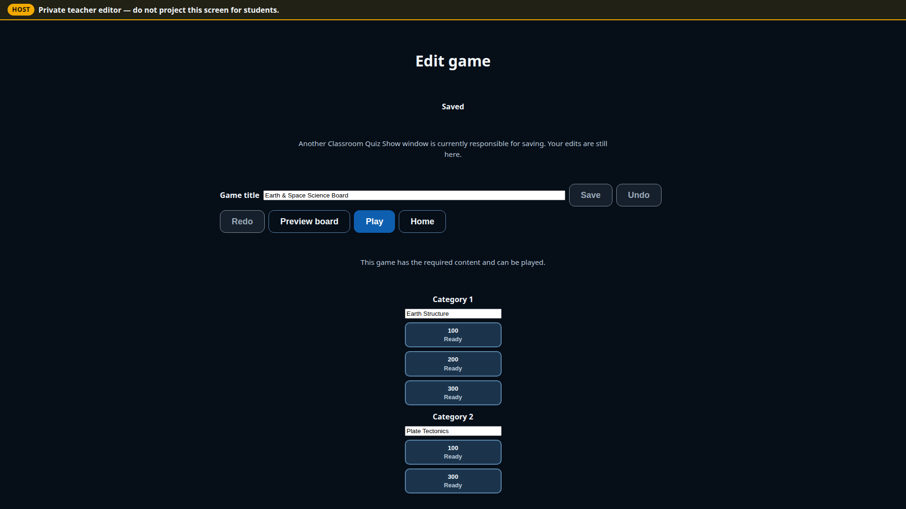

- **Screenshot:** `screenshots/authoring/authoring-edit-demo-1920x1080.png`
- **Role:** App
- **Class:** normal
- **Purpose:** In-app board authoring surface for a saved game
- **Trigger / state:** Home → Edit on demo game
- **Components:** `AuthoringRoute`
- **Route:** #/edit/:gameId
- **Privacy boundary:** host-private
- **UX principles:** P01, P06, P20 (teacher concepts / terminology)
- **Capture resolution:** 1920x1080
- **Capture method:** AUTOMATED-CAPTURE
- **Canonical code SHA:** `4368cc9eeb7dbf3ef342926e1d0fba7ba4c10f9b`
- **Milestone:** S05 complete / pre-owner-playthrough
- **Date:** 2026-09-24
- **Owner inspection:** required
- **Known limitations:** Browser Chromium capture; not Electron/Windows/projector/Sidecar evidence.

### `AUTH-IMPORT-SUCCESS` — Import quality report (success)

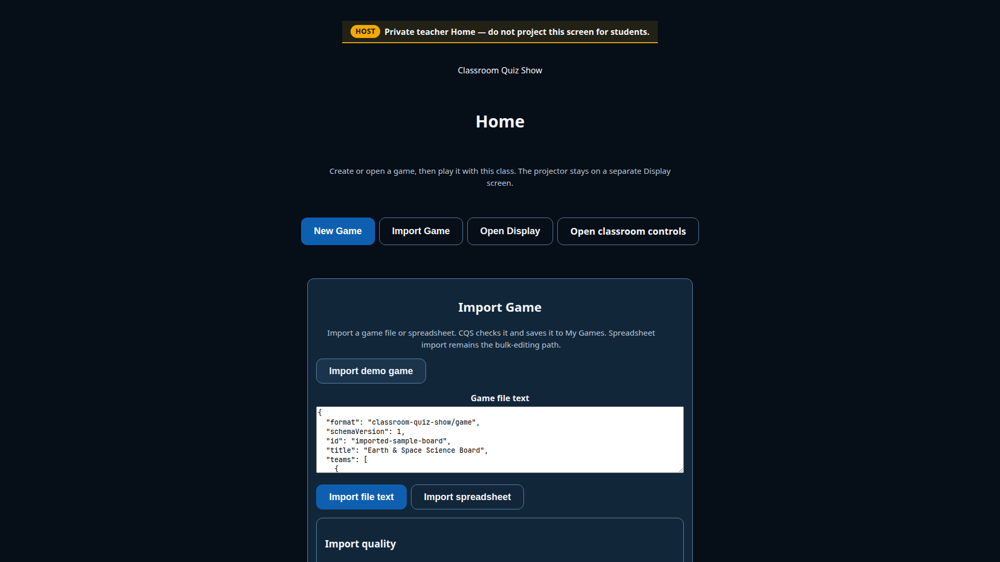

- **Screenshot:** `screenshots/authoring/authoring-import-success-1920x1080.png`
- **Role:** App
- **Class:** normal
- **Purpose:** Teacher-facing import success / quality report
- **Trigger / state:** Import demo game; quality report visible
- **Components:** `HomeRoute`, `ImportQualityReport`
- **Route:** #/
- **Privacy boundary:** host-private
- **UX principles:** P01, P06, P20 (teacher concepts / terminology)
- **Capture resolution:** 1920x1080
- **Capture method:** AUTOMATED-CAPTURE
- **Canonical code SHA:** `4368cc9eeb7dbf3ef342926e1d0fba7ba4c10f9b`
- **Milestone:** S05 complete / pre-owner-playthrough
- **Date:** 2026-09-24
- **Owner inspection:** required
- **Known limitations:** Browser Chromium capture; not Electron/Windows/projector/Sidecar evidence.

### `AUTH-IMPORT-FAILURE` — Import validation failure

- **Screenshot:** _pending — LOCAL-DESKTOP-CAPTURE_
- **Role:** App
- **Class:** edge
- **Purpose:** Malformed/unsupported content fail-closed messaging
- **Trigger / state:** Import intentionally invalid file on Home or Host
- **Components:** `HomeRoute`, `GamePackImportPanel`
- **Route:** #/
- **Privacy boundary:** host-private
- **UX principles:** P01, P06, P20 (teacher concepts / terminology)
- **Capture resolution:** n/a
- **Capture method:** LOCAL-DESKTOP-CAPTURE
- **Canonical code SHA:** `4368cc9eeb7dbf3ef342926e1d0fba7ba4c10f9b`
- **Milestone:** S05 complete / pre-owner-playthrough
- **Date:** 2026-09-24
- **Owner inspection:** required
- **Known limitations:** Requires a prepared invalid fixture file; owner may use Host import panel.

## Classroom setup

### `SETUP-CLASS-NAMES` — Class Setup — team names

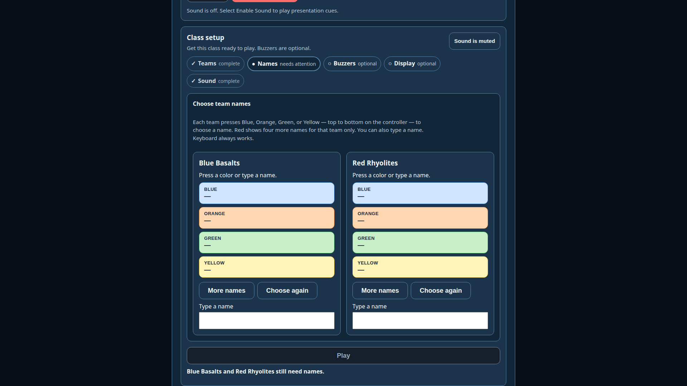

- **Screenshot:** `screenshots/setup/setup-class-team-names.png`
- **Role:** Host
- **Class:** normal
- **Purpose:** Team naming board before play
- **Trigger / state:** Home import demo → Class Setup names task
- **Components:** `ClassroomSetupPanel`
- **Route:** #/
- **Privacy boundary:** host-private
- **UX principles:** P02, P04, P05, P09 (operator hierarchy / private controls)
- **Capture resolution:** host-desktop
- **Capture method:** AUTOMATED-CAPTURE
- **Canonical code SHA:** `4368cc9eeb7dbf3ef342926e1d0fba7ba4c10f9b`
- **Milestone:** S05 complete / pre-owner-playthrough
- **Date:** 2026-09-24
- **Owner inspection:** required
- **Known limitations:** Browser Chromium capture; not Electron/Windows/projector/Sidecar evidence.

### `SETUP-SONY-COPY` — Class Setup — Sony ordinary copy

- **Screenshot:** `screenshots/setup/setup-sony-ordinary-copy.png`
- **Role:** Host
- **Class:** normal
- **Purpose:** Teacher-facing Sony setup copy without WebHID jargon
- **Trigger / state:** Class Setup visible after demo import
- **Components:** `ClassroomSetupPanel`
- **Route:** #/
- **Privacy boundary:** host-private
- **UX principles:** P02, P04, P05, P09 (operator hierarchy / private controls)
- **Capture resolution:** host-desktop
- **Capture method:** AUTOMATED-CAPTURE
- **Canonical code SHA:** `4368cc9eeb7dbf3ef342926e1d0fba7ba4c10f9b`
- **Milestone:** S05 complete / pre-owner-playthrough
- **Date:** 2026-09-24
- **Owner inspection:** required
- **Known limitations:** Browser Chromium capture; not Electron/Windows/projector/Sidecar evidence.

### `SETUP-PHYSICAL-SONY` — Sony physical pairing / sleep / wake

- **Screenshot:** _pending — OWNER-HARDWARE-CAPTURE_
- **Role:** Host
- **Class:** edge
- **Purpose:** Physical controller readiness and recovery
- **Trigger / state:** Namtai / Sony handsets on owner hardware
- **Components:** `ClassroomSetupPanel`
- **Route:** _n/a_
- **Privacy boundary:** host-private
- **UX principles:** P02, P04, P05, P09 (operator hierarchy / private controls)
- **Capture resolution:** n/a
- **Capture method:** OWNER-HARDWARE-CAPTURE
- **Canonical code SHA:** `4368cc9eeb7dbf3ef342926e1d0fba7ba4c10f9b`
- **Milestone:** S05 complete / pre-owner-playthrough
- **Date:** 2026-09-24
- **Owner inspection:** required
- **Known limitations:** See OWNER-CAPTURE-CHECKLIST.md.

### `S06-PHYSICAL-CONTROLLERS` — Physical Sony controllers in class

- **Screenshot:** _pending — S06-DEFERRED_
- **Role:** Host
- **Class:** edge
- **Purpose:** Classroom physical controller evidence
- **Trigger / state:** Authorized S06 hardware qualification
- **Components:** `ClassroomSetupPanel`, `input adapters`
- **Route:** _n/a_
- **Privacy boundary:** host-private
- **UX principles:** P02, P04, P05, P09 (operator hierarchy / private controls)
- **Capture resolution:** n/a
- **Capture method:** S06-DEFERRED
- **Canonical code SHA:** `4368cc9eeb7dbf3ef342926e1d0fba7ba4c10f9b`
- **Milestone:** S05 complete / pre-owner-playthrough
- **Date:** 2026-09-24
- **Owner inspection:** required
- **Known limitations:** Reserved for authorized S06; not part of this tranche.

## Host

### `APP-HOST-EMPTY` — Host empty / load a game

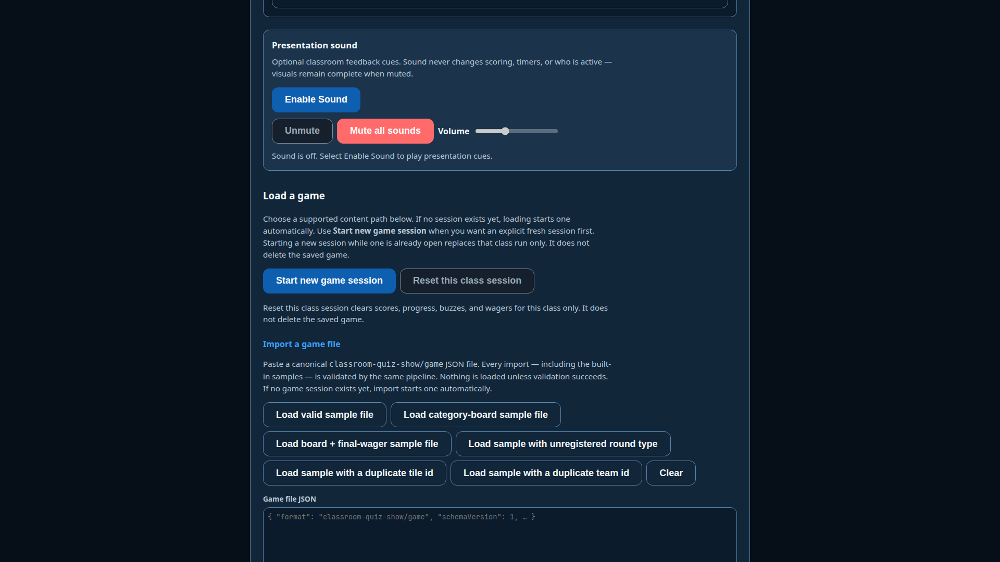

- **Screenshot:** `screenshots/host/host-empty-load-game.png`
- **Role:** Host
- **Class:** normal
- **Purpose:** Host console before a game is loaded
- **Trigger / state:** Open Host with no active session game
- **Components:** `HostRoute`, `GamePackImportPanel`
- **Route:** #/host
- **Privacy boundary:** host-private
- **UX principles:** P02, P04, P05, P09 (operator hierarchy / private controls)
- **Capture resolution:** host-desktop
- **Capture method:** AUTOMATED-CAPTURE
- **Canonical code SHA:** `4368cc9eeb7dbf3ef342926e1d0fba7ba4c10f9b`
- **Milestone:** S05 complete / pre-owner-playthrough
- **Date:** 2026-09-24
- **Owner inspection:** required
- **Known limitations:** Browser Chromium capture; not Electron/Windows/projector/Sidecar evidence.

### `HOST-BOARD-CONTROL` — Host category-board control

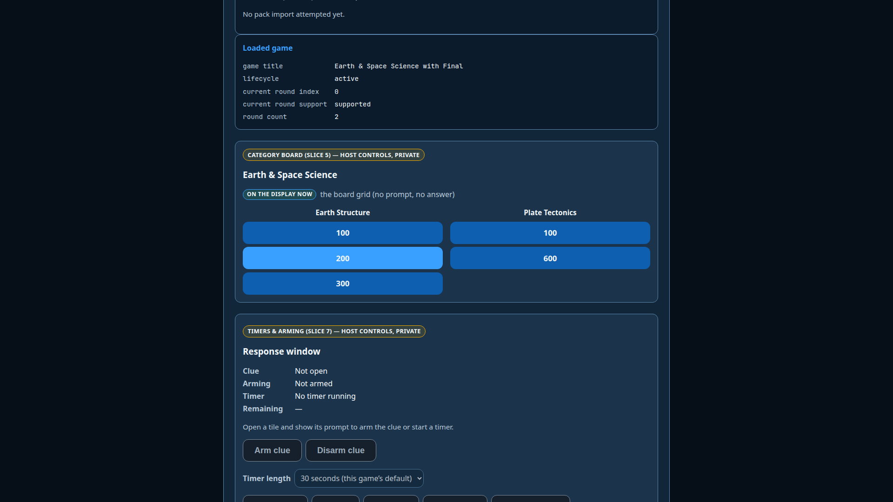

- **Screenshot:** `screenshots/host/host-board-control.png`
- **Role:** Host
- **Class:** normal
- **Purpose:** Private board controls with answers withheld from Audience
- **Trigger / state:** Load board+Final sample; advance to board
- **Components:** `CategoryBoardHost`, `HostRoute`
- **Route:** #/host
- **Privacy boundary:** host-private
- **UX principles:** P02, P04, P05, P09 (operator hierarchy / private controls)
- **Capture resolution:** host-desktop
- **Capture method:** AUTOMATED-CAPTURE
- **Canonical code SHA:** `4368cc9eeb7dbf3ef342926e1d0fba7ba4c10f9b`
- **Milestone:** S05 complete / pre-owner-playthrough
- **Date:** 2026-09-24
- **Owner inspection:** required
- **Known limitations:** Browser Chromium capture; not Electron/Windows/projector/Sidecar evidence.

### `HOST-CLUE-SELECTED` — Host clue selected / reveal controls

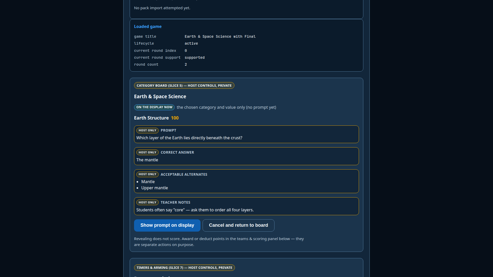

- **Screenshot:** `screenshots/host/host-clue-selected.png`
- **Role:** Host
- **Class:** normal
- **Purpose:** Host prompt/answer reveal and scoring targets
- **Trigger / state:** Select a board tile on Host
- **Components:** `CategoryBoardHost`, `TeamScoringPanel`
- **Route:** #/host
- **Privacy boundary:** host-private
- **UX principles:** P02, P04, P05, P09 (operator hierarchy / private controls)
- **Capture resolution:** host-desktop
- **Capture method:** AUTOMATED-CAPTURE
- **Canonical code SHA:** `4368cc9eeb7dbf3ef342926e1d0fba7ba4c10f9b`
- **Milestone:** S05 complete / pre-owner-playthrough
- **Date:** 2026-09-24
- **Owner inspection:** required
- **Known limitations:** Browser Chromium capture; not Electron/Windows/projector/Sidecar evidence.

### `HOST-FINAL-SETUP` — Host Final setup / begin

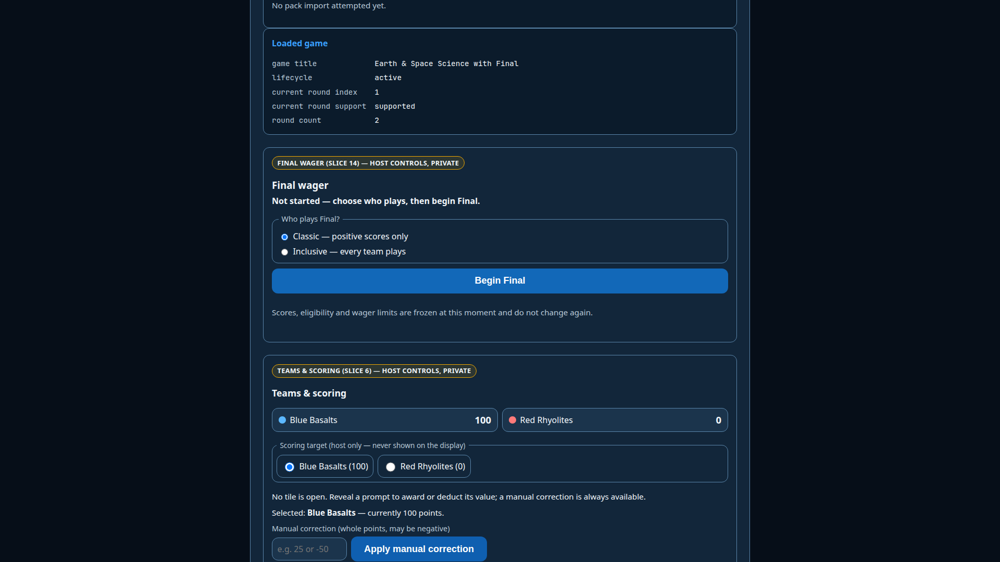

- **Screenshot:** `screenshots/host/host-final-setup.png`
- **Role:** Host
- **Class:** normal
- **Purpose:** Private Final controls before public wager window
- **Trigger / state:** Advance to Final after board scoring
- **Components:** `FinalWagerHostPanel`
- **Route:** #/host
- **Privacy boundary:** host-private
- **UX principles:** P02, P04, P05, P09 (operator hierarchy / private controls)
- **Capture resolution:** host-desktop
- **Capture method:** AUTOMATED-CAPTURE
- **Canonical code SHA:** `4368cc9eeb7dbf3ef342926e1d0fba7ba4c10f9b`
- **Milestone:** S05 complete / pre-owner-playthrough
- **Date:** 2026-09-24
- **Owner inspection:** required
- **Known limitations:** Browser Chromium capture; not Electron/Windows/projector/Sidecar evidence.

### `HOST-FINAL-SETTLEMENT` — Host Final settlement controls

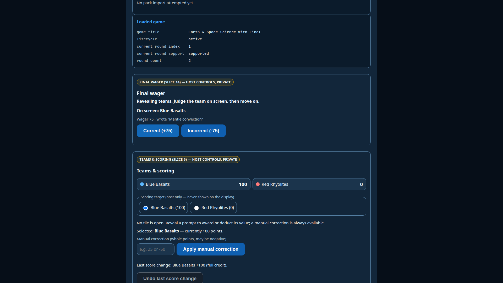

- **Screenshot:** `screenshots/host/host-final-settlement.png`
- **Role:** Host
- **Class:** normal
- **Purpose:** Host adjudication during team reveal
- **Trigger / state:** Reach Final team-reveal on Host
- **Components:** `FinalWagerHostPanel`
- **Route:** #/host
- **Privacy boundary:** host-private
- **UX principles:** P02, P04, P05, P09 (operator hierarchy / private controls)
- **Capture resolution:** host-desktop
- **Capture method:** AUTOMATED-CAPTURE
- **Canonical code SHA:** `4368cc9eeb7dbf3ef342926e1d0fba7ba4c10f9b`
- **Milestone:** S05 complete / pre-owner-playthrough
- **Date:** 2026-09-24
- **Owner inspection:** required
- **Known limitations:** Browser Chromium capture; not Electron/Windows/projector/Sidecar evidence.

### `HOST-ELECTRON-CHROME` — Electron Host window chrome

- **Screenshot:** _pending — LOCAL-DESKTOP-CAPTURE_
- **Role:** Host
- **Class:** normal
- **Purpose:** Native window chrome / menu / dual-window shell
- **Trigger / state:** Packaged or `npm run desktop` Electron Host
- **Components:** `desktop main process`
- **Route:** _n/a_
- **Privacy boundary:** host-private
- **UX principles:** P02, P04, P05, P09 (operator hierarchy / private controls)
- **Capture resolution:** n/a
- **Capture method:** LOCAL-DESKTOP-CAPTURE
- **Canonical code SHA:** `4368cc9eeb7dbf3ef342926e1d0fba7ba4c10f9b`
- **Milestone:** S05 complete / pre-owner-playthrough
- **Date:** 2026-09-24
- **Owner inspection:** required
- **Known limitations:** None recorded.

### `DESKTOP-DUAL-WINDOW` — Electron Host + Display dual window

- **Screenshot:** _pending — LOCAL-DESKTOP-CAPTURE_
- **Role:** Shared
- **Class:** normal
- **Purpose:** Native dual-window placement on owner desktop
- **Trigger / state:** Electron shell opens Host + Display windows
- **Components:** `desktop main process`
- **Route:** _n/a_
- **Privacy boundary:** shared-teacher
- **UX principles:** P10, P11 (display recovery / fail-closed)
- **Capture resolution:** n/a
- **Capture method:** LOCAL-DESKTOP-CAPTURE
- **Canonical code SHA:** `4368cc9eeb7dbf3ef342926e1d0fba7ba4c10f9b`
- **Milestone:** S05 complete / pre-owner-playthrough
- **Date:** 2026-09-24
- **Owner inspection:** required
- **Known limitations:** None recorded.

### `SIDECAR-TWO-SCREEN` — MacBook Host + iPad Sidecar Audience

- **Screenshot:** _pending — OWNER-HARDWARE-CAPTURE_
- **Role:** Shared
- **Class:** edge
- **Purpose:** Owner playthrough two-screen Sidecar arrangement
- **Trigger / state:** Rick Sidecar extended display playthrough
- **Components:** `Electron display enumeration`
- **Route:** _n/a_
- **Privacy boundary:** shared-teacher
- **UX principles:** P10, P11 (display recovery / fail-closed)
- **Capture resolution:** n/a
- **Capture method:** OWNER-HARDWARE-CAPTURE
- **Canonical code SHA:** `4368cc9eeb7dbf3ef342926e1d0fba7ba4c10f9b`
- **Milestone:** S05 complete / pre-owner-playthrough
- **Date:** 2026-09-24
- **Owner inspection:** required
- **Known limitations:** Not classroom-projector qualification (S06). See OWNER-CAPTURE-CHECKLIST.md.

## Audience board

### `AUD-BOARD-PRISTINE` — Audience pristine board

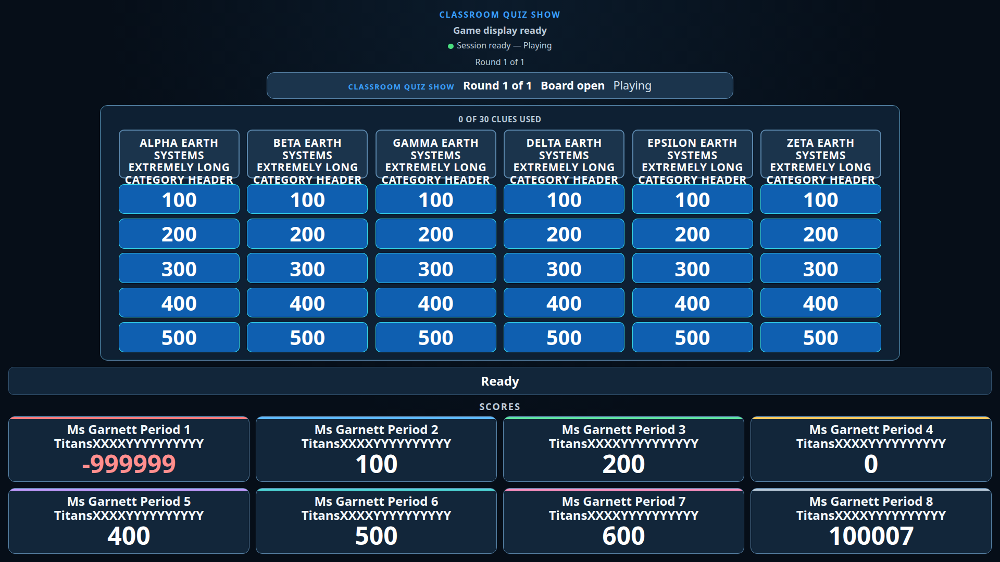

- **Screenshot:** `screenshots/audience/audience-board-pristine-1920x1080.png`
- **Role:** Audience
- **Class:** normal
- **Purpose:** Unused category board with eight stress teams
- **Trigger / state:** Inject visualStressFreshBoardSnapshot
- **Components:** `CategoryBoardDisplay`, `AudienceDisplayShell`, `TeamScoreboard`
- **Route:** #/display
- **Privacy boundary:** public
- **UX principles:** P13, P14, P15, P17 (projector readability / causality)
- **Capture resolution:** 1920x1080
- **Capture method:** AUTOMATED-CAPTURE
- **Canonical code SHA:** `4368cc9eeb7dbf3ef342926e1d0fba7ba4c10f9b`
- **Milestone:** S05 complete / pre-owner-playthrough
- **Date:** 2026-09-24
- **Owner inspection:** required
- **Known limitations:** Browser Chromium capture; not Electron/Windows/projector/Sidecar evidence.

### `AUD-BOARD-PARTIAL` — Audience partially used board

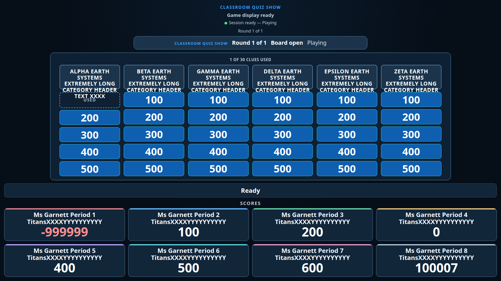

- **Screenshot:** `screenshots/audience/audience-board-partial-1920x1080.png`
- **Role:** Audience
- **Class:** normal
- **Purpose:** Used vs unused tiles; long category titles; score extremes
- **Trigger / state:** Inject visualStressBoardSnapshot
- **Components:** `CategoryBoardDisplay`, `TeamScoreboard`
- **Route:** #/display
- **Privacy boundary:** public
- **UX principles:** P13, P14, P15, P17 (projector readability / causality)
- **Capture resolution:** 1920x1080
- **Capture method:** AUTOMATED-CAPTURE
- **Canonical code SHA:** `4368cc9eeb7dbf3ef342926e1d0fba7ba4c10f9b`
- **Milestone:** S05 complete / pre-owner-playthrough
- **Date:** 2026-09-24
- **Owner inspection:** required
- **Known limitations:** Browser Chromium capture; not Electron/Windows/projector/Sidecar evidence.

### `AUD-BOARD-DEPLETED` — Audience nearly/fully depleted board

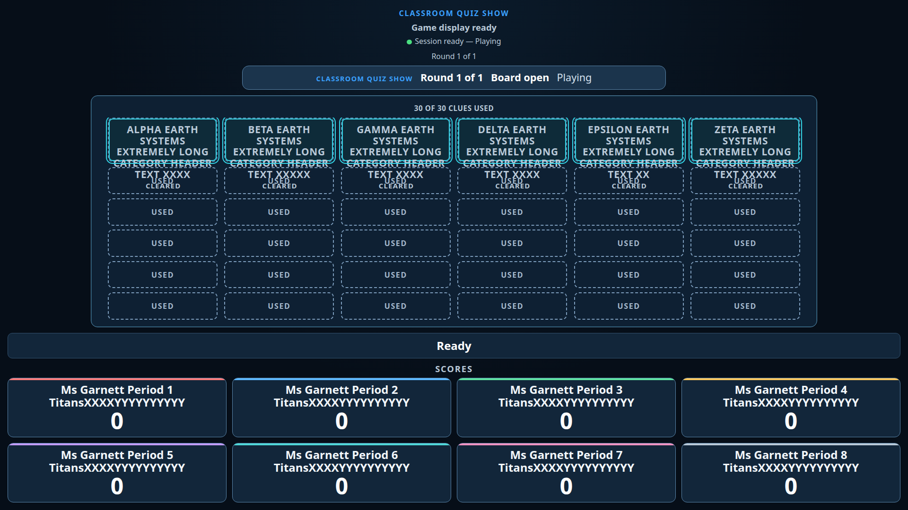

- **Screenshot:** `screenshots/audience/audience-board-depleted-1920x1080.png`
- **Role:** Audience
- **Class:** edge
- **Purpose:** All tiles used; board exhaustion presentation
- **Trigger / state:** Inject visualHistoryBoardDepletedSnapshot
- **Components:** `CategoryBoardDisplay`
- **Route:** #/display
- **Privacy boundary:** public
- **UX principles:** P13, P14, P15, P17 (projector readability / causality)
- **Capture resolution:** 1920x1080
- **Capture method:** AUTOMATED-CAPTURE
- **Canonical code SHA:** `4368cc9eeb7dbf3ef342926e1d0fba7ba4c10f9b`
- **Milestone:** S05 complete / pre-owner-playthrough
- **Date:** 2026-09-24
- **Owner inspection:** required
- **Known limitations:** Browser Chromium capture; not Electron/Windows/projector/Sidecar evidence.

## Clue / question

### `AUD-CLUE-SELECTED` — Audience clue selected

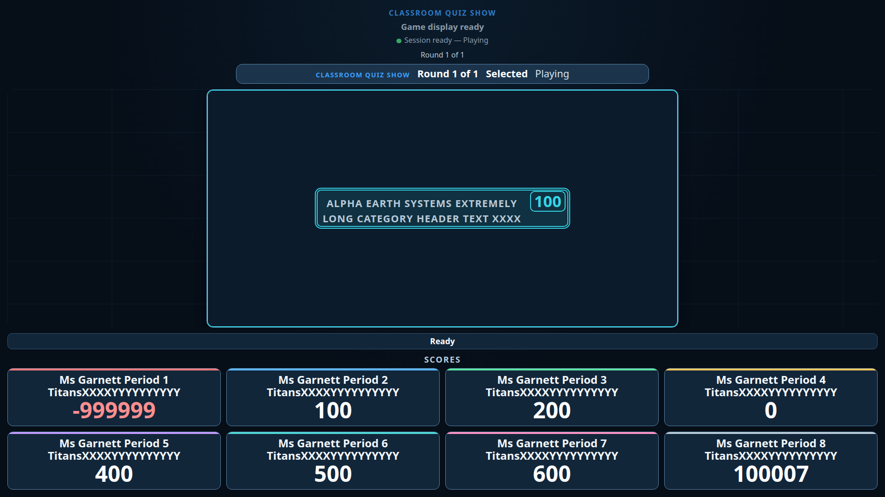

- **Screenshot:** `screenshots/clue/audience-clue-selected-1920x1080.png`
- **Role:** Audience
- **Class:** normal
- **Purpose:** Category/value selection before prompt
- **Trigger / state:** Inject visualStressSelectedSnapshot
- **Components:** `CategoryBoardDisplay`
- **Route:** #/display
- **Privacy boundary:** public
- **UX principles:** P13, P14, P15, P17 (projector readability / causality)
- **Capture resolution:** 1920x1080
- **Capture method:** AUTOMATED-CAPTURE
- **Canonical code SHA:** `4368cc9eeb7dbf3ef342926e1d0fba7ba4c10f9b`
- **Milestone:** S05 complete / pre-owner-playthrough
- **Date:** 2026-09-24
- **Owner inspection:** required
- **Known limitations:** Browser Chromium capture; not Electron/Windows/projector/Sidecar evidence.

### `AUD-CLUE-PROMPT` — Audience prompt (quiet cognition)

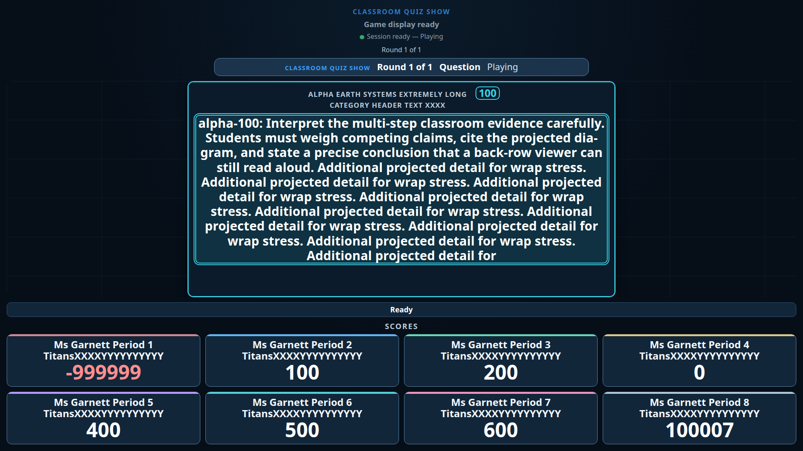

- **Screenshot:** `screenshots/clue/audience-clue-prompt-1920x1080.png`
- **Role:** Audience
- **Class:** normal
- **Purpose:** Prompt revealed without buzz arming
- **Trigger / state:** Inject visualStressPromptOnlySnapshot
- **Components:** `CategoryBoardDisplay`
- **Route:** #/display
- **Privacy boundary:** public
- **UX principles:** P13, P14, P15, P17 (projector readability / causality)
- **Capture resolution:** 1920x1080
- **Capture method:** AUTOMATED-CAPTURE
- **Canonical code SHA:** `4368cc9eeb7dbf3ef342926e1d0fba7ba4c10f9b`
- **Milestone:** S05 complete / pre-owner-playthrough
- **Date:** 2026-09-24
- **Owner inspection:** required
- **Known limitations:** Browser Chromium capture; not Electron/Windows/projector/Sidecar evidence.

### `AUD-CLUE-ANSWER` — Audience answer revealed

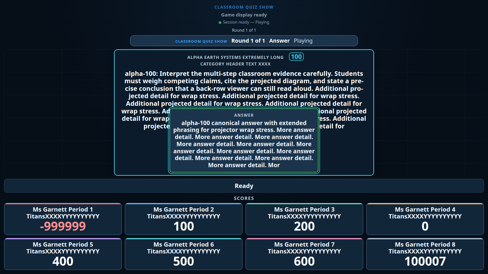

- **Screenshot:** `screenshots/clue/audience-clue-answer-revealed-1920x1080.png`
- **Role:** Audience
- **Class:** normal
- **Purpose:** Answer reveal retaining the prompt
- **Trigger / state:** Inject visualStressAnswerRevealSnapshot
- **Components:** `CategoryBoardDisplay`
- **Route:** #/display
- **Privacy boundary:** public
- **UX principles:** P13, P14, P15, P17 (projector readability / causality)
- **Capture resolution:** 1920x1080
- **Capture method:** AUTOMATED-CAPTURE
- **Canonical code SHA:** `4368cc9eeb7dbf3ef342926e1d0fba7ba4c10f9b`
- **Milestone:** S05 complete / pre-owner-playthrough
- **Date:** 2026-09-24
- **Owner inspection:** required
- **Known limitations:** Browser Chromium capture; not Electron/Windows/projector/Sidecar evidence.

## Buzz

### `AUD-BUZZ-ARMED` — Audience buzz open / waiting

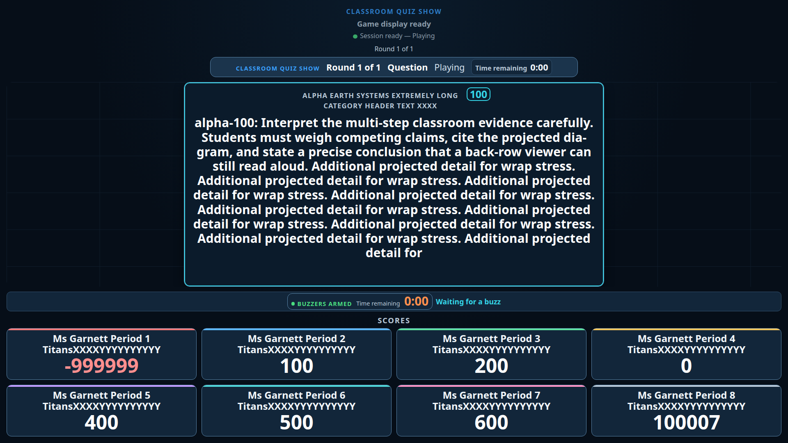

- **Screenshot:** `screenshots/buzz/audience-buzz-armed-waiting-1920x1080.png`
- **Role:** Audience
- **Class:** normal
- **Purpose:** Response armed with no active claim
- **Trigger / state:** Inject visualStressArmedWaitingBuzzSnapshot
- **Components:** `BuzzQueueDisplay`, `SignalRail`
- **Route:** #/display
- **Privacy boundary:** public
- **UX principles:** P13, P14, P15, P17 (projector readability / causality)
- **Capture resolution:** 1920x1080
- **Capture method:** AUTOMATED-CAPTURE
- **Canonical code SHA:** `4368cc9eeb7dbf3ef342926e1d0fba7ba4c10f9b`
- **Milestone:** S05 complete / pre-owner-playthrough
- **Date:** 2026-09-24
- **Owner inspection:** required
- **Known limitations:** Browser Chromium capture; not Electron/Windows/projector/Sidecar evidence.

### `AUD-BUZZ-ACTIVE` — Audience active claim

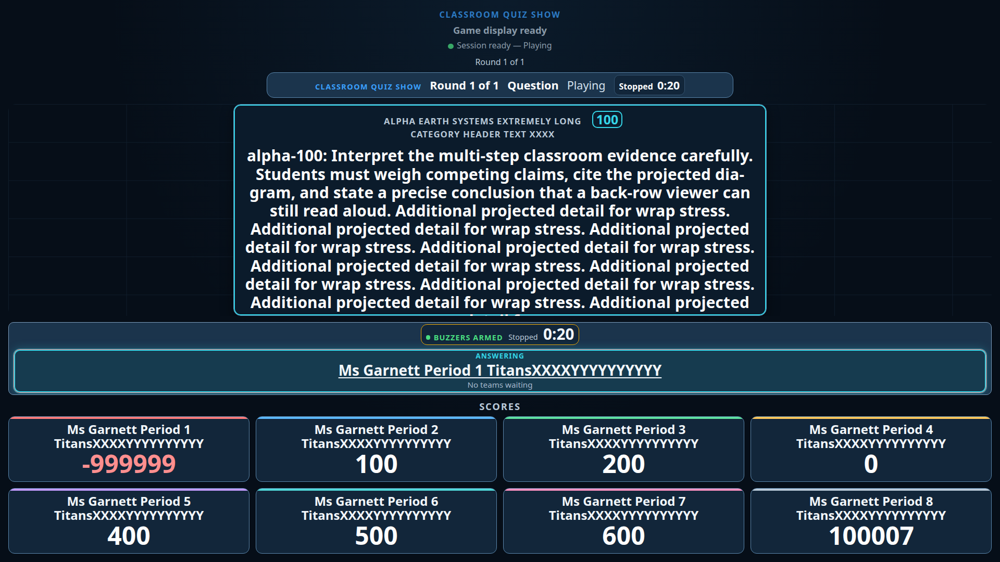

- **Screenshot:** `screenshots/buzz/audience-buzz-active-claim-1920x1080.png`
- **Role:** Audience
- **Class:** normal
- **Purpose:** First active claim identity + waiting count
- **Trigger / state:** Inject visualStressFirstActiveClaimSnapshot
- **Components:** `BuzzQueueDisplay`
- **Route:** #/display
- **Privacy boundary:** public
- **UX principles:** P13, P14, P15, P17 (projector readability / causality)
- **Capture resolution:** 1920x1080
- **Capture method:** AUTOMATED-CAPTURE
- **Canonical code SHA:** `4368cc9eeb7dbf3ef342926e1d0fba7ba4c10f9b`
- **Milestone:** S05 complete / pre-owner-playthrough
- **Date:** 2026-09-24
- **Owner inspection:** required
- **Known limitations:** Browser Chromium capture; not Electron/Windows/projector/Sidecar evidence.

### `AUD-BUZZ-MAX-WAITING` — Audience active claim max waiting

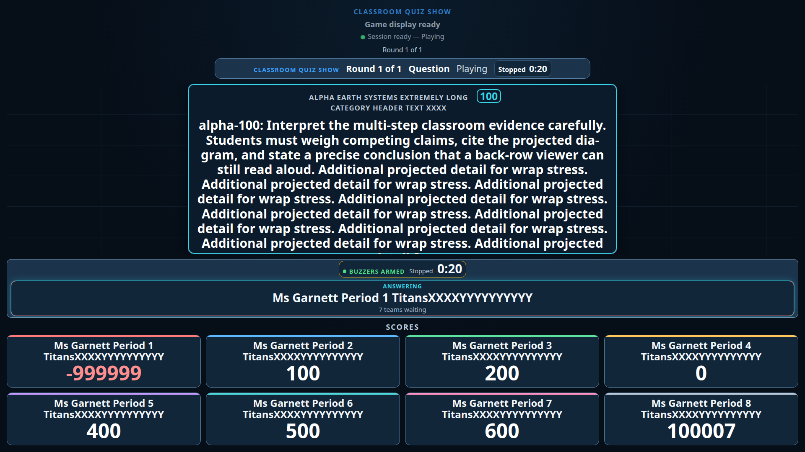

- **Screenshot:** `screenshots/buzz/audience-buzz-active-max-waiting-1920x1080.png`
- **Role:** Audience
- **Class:** stress
- **Purpose:** Eight-team waiting count stress
- **Trigger / state:** Inject visualStressActiveClaimMaxWaitingSnapshot
- **Components:** `BuzzQueueDisplay`
- **Route:** #/display
- **Privacy boundary:** public
- **UX principles:** P13, P14, P15, P17 (projector readability / causality)
- **Capture resolution:** 1920x1080
- **Capture method:** AUTOMATED-CAPTURE
- **Canonical code SHA:** `4368cc9eeb7dbf3ef342926e1d0fba7ba4c10f9b`
- **Milestone:** S05 complete / pre-owner-playthrough
- **Date:** 2026-09-24
- **Owner inspection:** required
- **Known limitations:** Browser Chromium capture; not Electron/Windows/projector/Sidecar evidence.

## Outcome

### `AUD-OUTCOME-CORRECT` — Audience correct outcome

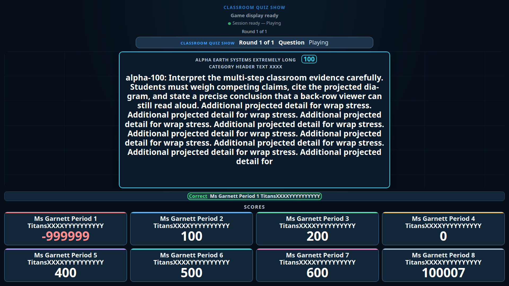

- **Screenshot:** `screenshots/outcome/audience-outcome-correct-1920x1080.png`
- **Role:** Audience
- **Class:** normal
- **Purpose:** Path A Correct adjudication presentation
- **Trigger / state:** Inject visualStressBoardCorrectOutcomeSnapshot
- **Components:** `BoardOutcomeDisplay`
- **Route:** #/display
- **Privacy boundary:** public
- **UX principles:** P13, P14, P15, P17 (projector readability / causality)
- **Capture resolution:** 1920x1080
- **Capture method:** AUTOMATED-CAPTURE
- **Canonical code SHA:** `4368cc9eeb7dbf3ef342926e1d0fba7ba4c10f9b`
- **Milestone:** S05 complete / pre-owner-playthrough
- **Date:** 2026-09-24
- **Owner inspection:** required
- **Known limitations:** Browser Chromium capture; not Electron/Windows/projector/Sidecar evidence.

### `AUD-OUTCOME-INCORRECT` — Audience incorrect + promoted claim

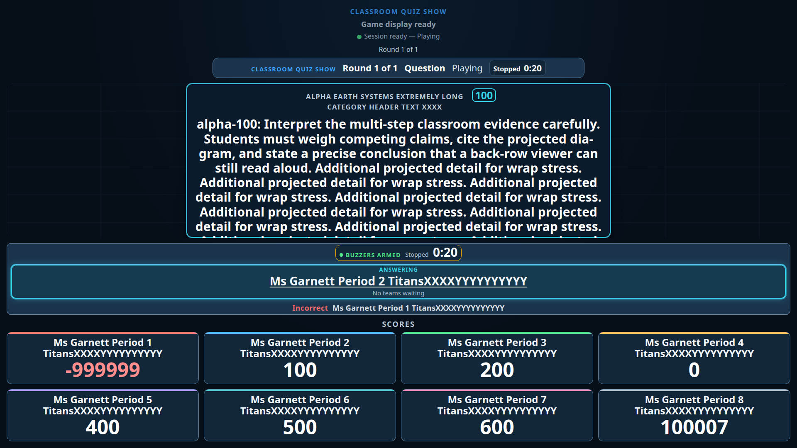

- **Screenshot:** `screenshots/outcome/audience-outcome-incorrect-with-active-1920x1080.png`
- **Role:** Audience
- **Class:** normal
- **Purpose:** Incorrect outcome beside next active claim
- **Trigger / state:** Inject visualStressBoardIncorrectWithActiveSnapshot
- **Components:** `BoardOutcomeDisplay`, `BuzzQueueDisplay`
- **Route:** #/display
- **Privacy boundary:** public
- **UX principles:** P13, P14, P15, P17 (projector readability / causality)
- **Capture resolution:** 1920x1080
- **Capture method:** AUTOMATED-CAPTURE
- **Canonical code SHA:** `4368cc9eeb7dbf3ef342926e1d0fba7ba4c10f9b`
- **Milestone:** S05 complete / pre-owner-playthrough
- **Date:** 2026-09-24
- **Owner inspection:** required
- **Known limitations:** Browser Chromium capture; not Electron/Windows/projector/Sidecar evidence.

### `AUD-OUTCOME-PASSED` — Audience passed / no-response outcome

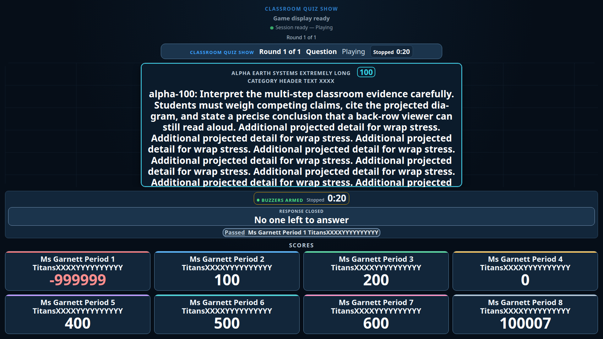

- **Screenshot:** `screenshots/outcome/audience-outcome-passed-1920x1080.png`
- **Role:** Audience
- **Class:** normal
- **Purpose:** Passed adjudication with exhausted queue
- **Trigger / state:** Inject visualStressBoardPassedOutcomeSnapshot
- **Components:** `BoardOutcomeDisplay`
- **Route:** #/display
- **Privacy boundary:** public
- **UX principles:** P13, P14, P15, P17 (projector readability / causality)
- **Capture resolution:** 1920x1080
- **Capture method:** AUTOMATED-CAPTURE
- **Canonical code SHA:** `4368cc9eeb7dbf3ef342926e1d0fba7ba4c10f9b`
- **Milestone:** S05 complete / pre-owner-playthrough
- **Date:** 2026-09-24
- **Owner inspection:** required
- **Known limitations:** Browser Chromium capture; not Electron/Windows/projector/Sidecar evidence.

## Scoreboard

### `AUD-SCOREBOARD-STRESS` — Audience scoreboard stress (8 teams / negatives)

- **Screenshot:** `screenshots/scoreboard/audience-scoreboard-stress-1920x1080.png`
- **Role:** Audience
- **Class:** stress
- **Purpose:** Long names, negative and large scores, eight teams
- **Trigger / state:** Board partial snapshot score strip/column
- **Components:** `TeamScoreboard`, `ScoreLayout`
- **Route:** #/display
- **Privacy boundary:** public
- **UX principles:** P13, P14, P15, P17 (projector readability / causality)
- **Capture resolution:** 1920x1080
- **Capture method:** AUTOMATED-CAPTURE
- **Canonical code SHA:** `4368cc9eeb7dbf3ef342926e1d0fba7ba4c10f9b`
- **Milestone:** S05 complete / pre-owner-playthrough
- **Date:** 2026-09-24
- **Owner inspection:** required
- **Known limitations:** Same frame as AUD-BOARD-PARTIAL; captured as dedicated crop-intent full frame. Browser Chromium capture; not Electron/Windows/projector/Sidecar evidence.

## Round flow

### `AUD-BOARD-CLEARED-CATEGORY` — Audience cleared-category board

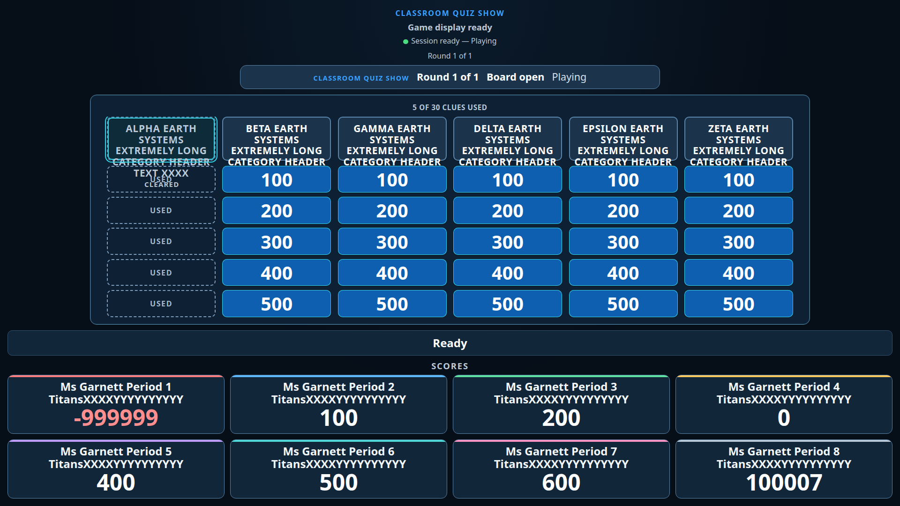

- **Screenshot:** `screenshots/round-flow/audience-board-category-cleared-1920x1080.png`
- **Role:** Audience
- **Class:** edge
- **Purpose:** Durable Cleared label after category depletion
- **Trigger / state:** Inject visualStressCategoryClearedBoardSnapshot
- **Components:** `CategoryBoardDisplay`
- **Route:** #/display
- **Privacy boundary:** public
- **UX principles:** P13, P14, P15, P17 (projector readability / causality)
- **Capture resolution:** 1920x1080
- **Capture method:** AUTOMATED-CAPTURE
- **Canonical code SHA:** `4368cc9eeb7dbf3ef342926e1d0fba7ba4c10f9b`
- **Milestone:** S05 complete / pre-owner-playthrough
- **Date:** 2026-09-24
- **Owner inspection:** required
- **Known limitations:** Browser Chromium capture; not Electron/Windows/projector/Sidecar evidence.

### `AUD-ROUND-FINAL-BRIDGE` — Audience board → Final bridge

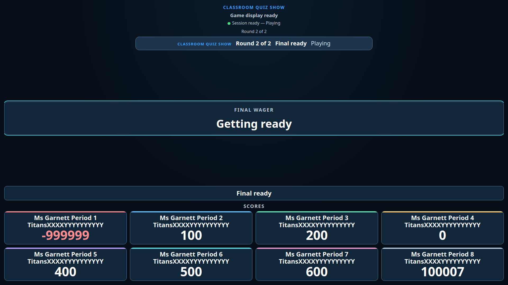

- **Screenshot:** `screenshots/round-flow/audience-round-final-bridge-1920x1080.png`
- **Role:** Audience
- **Class:** normal
- **Purpose:** Display-side transition into Final setup
- **Trigger / state:** Inject visualStressFinalSetupFromBoardSnapshot
- **Components:** `FinalWagerDisplay`, `AudienceDisplayShell`
- **Route:** #/display
- **Privacy boundary:** public
- **UX principles:** P13, P14, P15, P17 (projector readability / causality)
- **Capture resolution:** 1920x1080
- **Capture method:** AUTOMATED-CAPTURE
- **Canonical code SHA:** `4368cc9eeb7dbf3ef342926e1d0fba7ba4c10f9b`
- **Milestone:** S05 complete / pre-owner-playthrough
- **Date:** 2026-09-24
- **Owner inspection:** required
- **Known limitations:** Browser Chromium capture; not Electron/Windows/projector/Sidecar evidence.

## Final

### `AUD-FINAL-SETUP` — Audience Final setup

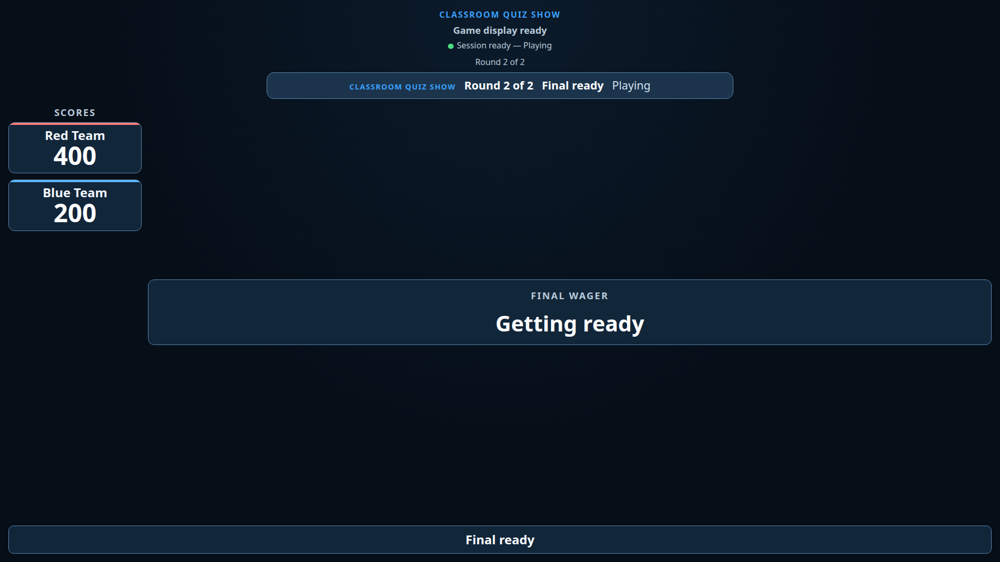

- **Screenshot:** `screenshots/final/audience-final-setup-1920x1080.png`
- **Role:** Audience
- **Class:** normal
- **Purpose:** Neutral Final getting-ready panel
- **Trigger / state:** Inject visualHistoryFinalSetupSnapshot
- **Components:** `FinalWagerDisplay`
- **Route:** #/display
- **Privacy boundary:** public
- **UX principles:** P13, P14, P15, P17 (projector readability / causality)
- **Capture resolution:** 1920x1080
- **Capture method:** AUTOMATED-CAPTURE
- **Canonical code SHA:** `4368cc9eeb7dbf3ef342926e1d0fba7ba4c10f9b`
- **Milestone:** S05 complete / pre-owner-playthrough
- **Date:** 2026-09-24
- **Owner inspection:** required
- **Known limitations:** Browser Chromium capture; not Electron/Windows/projector/Sidecar evidence.

### `AUD-FINAL-WAGER` — Audience Final wager phase

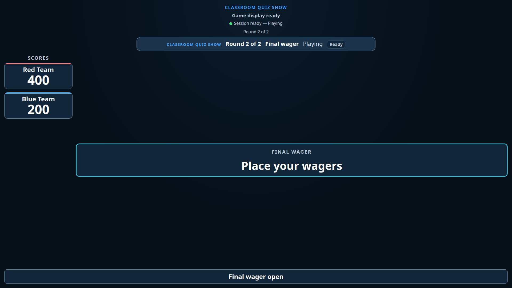

- **Screenshot:** `screenshots/final/audience-final-wager-entry-1920x1080.png`
- **Role:** Audience
- **Class:** normal
- **Purpose:** Public wager window without wager amounts
- **Trigger / state:** Inject visualHistoryFinalWagerEntrySnapshot
- **Components:** `FinalWagerDisplay`, `SignalRail`
- **Route:** #/display
- **Privacy boundary:** public
- **UX principles:** P13, P14, P15, P17 (projector readability / causality)
- **Capture resolution:** 1920x1080
- **Capture method:** AUTOMATED-CAPTURE
- **Canonical code SHA:** `4368cc9eeb7dbf3ef342926e1d0fba7ba4c10f9b`
- **Milestone:** S05 complete / pre-owner-playthrough
- **Date:** 2026-09-24
- **Owner inspection:** required
- **Known limitations:** Browser Chromium capture; not Electron/Windows/projector/Sidecar evidence.

### `AUD-FINAL-WAGERS-LOCKED` — Audience Final wagers locked

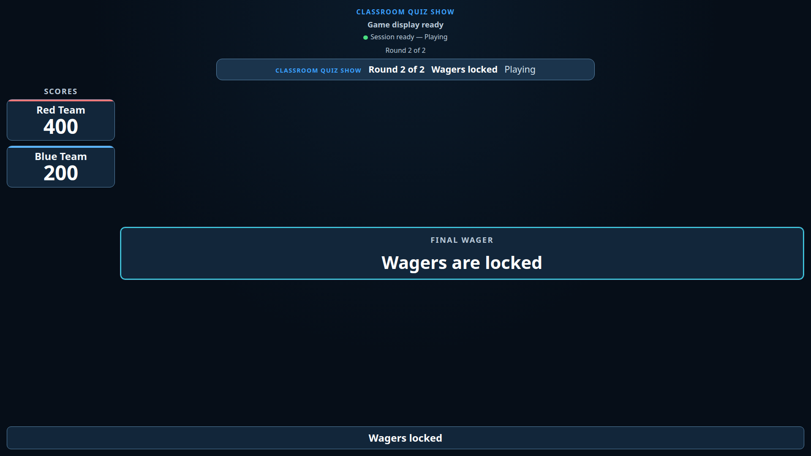

- **Screenshot:** `screenshots/final/audience-final-wagers-locked-1920x1080.png`
- **Role:** Audience
- **Class:** normal
- **Purpose:** Locked wager phase in words
- **Trigger / state:** Inject visualHistoryFinalWagersLockedSnapshot
- **Components:** `FinalWagerDisplay`
- **Route:** #/display
- **Privacy boundary:** public
- **UX principles:** P13, P14, P15, P17 (projector readability / causality)
- **Capture resolution:** 1920x1080
- **Capture method:** AUTOMATED-CAPTURE
- **Canonical code SHA:** `4368cc9eeb7dbf3ef342926e1d0fba7ba4c10f9b`
- **Milestone:** S05 complete / pre-owner-playthrough
- **Date:** 2026-09-24
- **Owner inspection:** required
- **Known limitations:** Browser Chromium capture; not Electron/Windows/projector/Sidecar evidence.

### `AUD-FINAL-RESPONSE` — Audience Final response phase

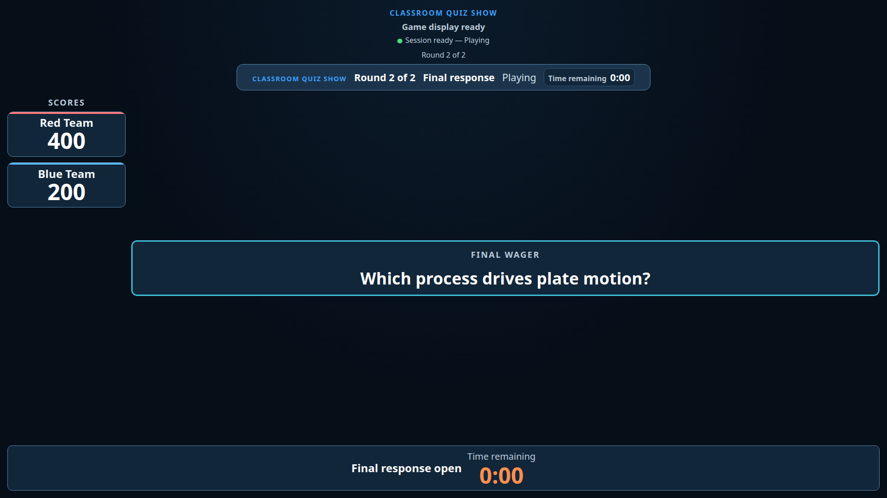

- **Screenshot:** `screenshots/final/audience-final-response-entry-1920x1080.png`
- **Role:** Audience
- **Class:** normal
- **Purpose:** Question public; answers/responses still private
- **Trigger / state:** Inject visualHistoryFinalResponseEntrySnapshot
- **Components:** `FinalWagerDisplay`
- **Route:** #/display
- **Privacy boundary:** public
- **UX principles:** P13, P14, P15, P17 (projector readability / causality)
- **Capture resolution:** 1920x1080
- **Capture method:** AUTOMATED-CAPTURE
- **Canonical code SHA:** `4368cc9eeb7dbf3ef342926e1d0fba7ba4c10f9b`
- **Milestone:** S05 complete / pre-owner-playthrough
- **Date:** 2026-09-24
- **Owner inspection:** required
- **Known limitations:** Browser Chromium capture; not Electron/Windows/projector/Sidecar evidence.

### `AUD-FINAL-RESPONSES-LOCKED` — Audience Final responses locked

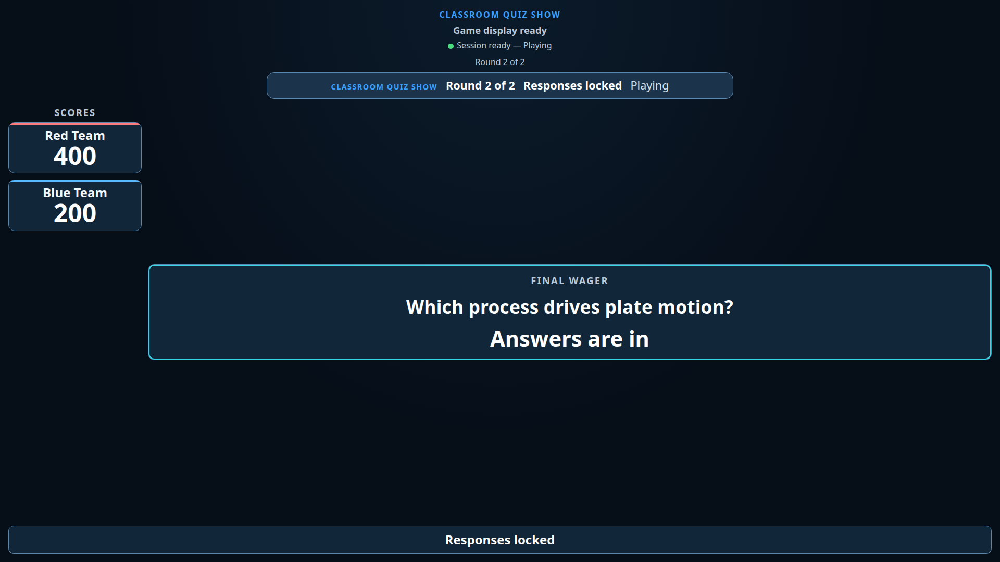

- **Screenshot:** `screenshots/final/audience-final-responses-locked-1920x1080.png`
- **Role:** Audience
- **Class:** normal
- **Purpose:** Prompt remains; responses not yet public
- **Trigger / state:** Inject visualHistoryFinalResponsesLockedSnapshot
- **Components:** `FinalWagerDisplay`
- **Route:** #/display
- **Privacy boundary:** public
- **UX principles:** P13, P14, P15, P17 (projector readability / causality)
- **Capture resolution:** 1920x1080
- **Capture method:** AUTOMATED-CAPTURE
- **Canonical code SHA:** `4368cc9eeb7dbf3ef342926e1d0fba7ba4c10f9b`
- **Milestone:** S05 complete / pre-owner-playthrough
- **Date:** 2026-09-24
- **Owner inspection:** required
- **Known limitations:** Browser Chromium capture; not Electron/Windows/projector/Sidecar evidence.

### `AUD-FINAL-ANSWER` — Audience Final answer revealed

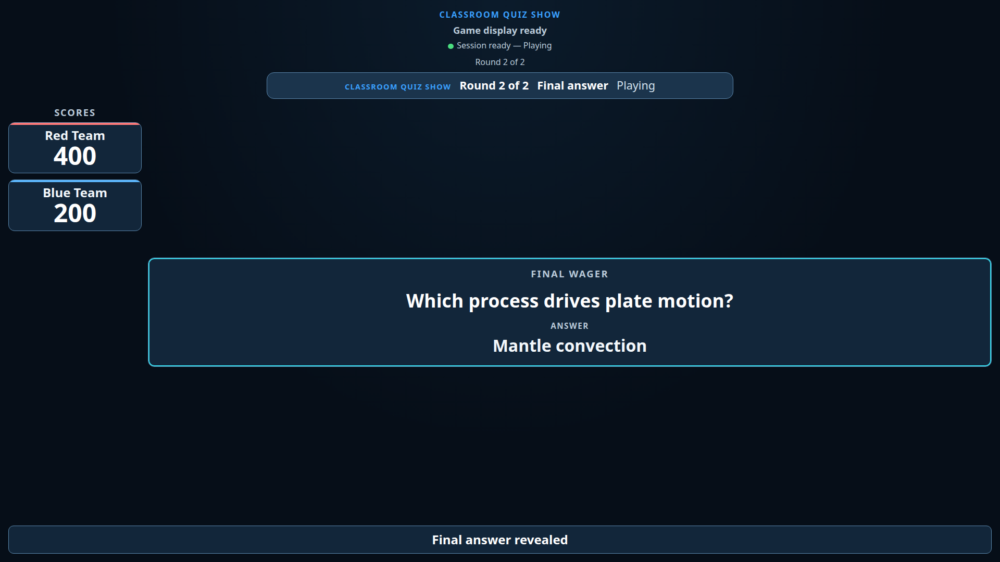

- **Screenshot:** `screenshots/final/audience-final-answer-revealed-1920x1080.png`
- **Role:** Audience
- **Class:** normal
- **Purpose:** Canonical answer beside prompt
- **Trigger / state:** Inject visualHistoryFinalAnswerRevealedSnapshot
- **Components:** `FinalWagerDisplay`
- **Route:** #/display
- **Privacy boundary:** public
- **UX principles:** P13, P14, P15, P17 (projector readability / causality)
- **Capture resolution:** 1920x1080
- **Capture method:** AUTOMATED-CAPTURE
- **Canonical code SHA:** `4368cc9eeb7dbf3ef342926e1d0fba7ba4c10f9b`
- **Milestone:** S05 complete / pre-owner-playthrough
- **Date:** 2026-09-24
- **Owner inspection:** required
- **Known limitations:** Browser Chromium capture; not Electron/Windows/projector/Sidecar evidence.

### `AUD-FINAL-TEAM-PENDING` — Audience Final team reveal pending settlement

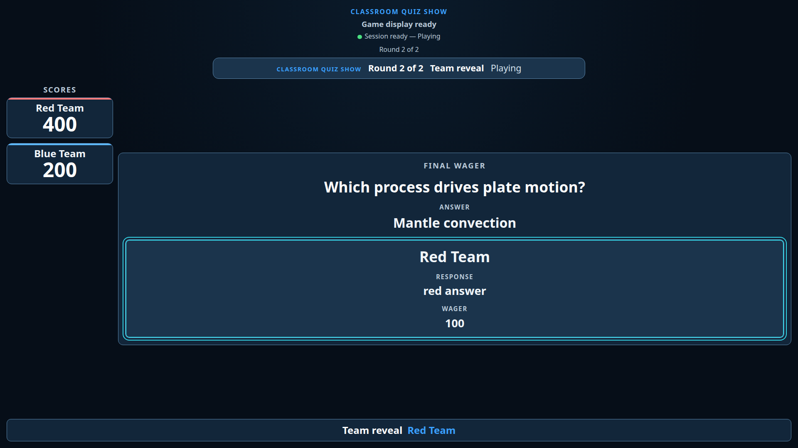

- **Screenshot:** `screenshots/final/audience-final-team-reveal-pending-1920x1080.png`
- **Role:** Audience
- **Class:** normal
- **Purpose:** One team response/wager public before adjudication
- **Trigger / state:** Inject visualHistoryFinalTeamRevealPendingSnapshot
- **Components:** `FinalWagerDisplay`
- **Route:** #/display
- **Privacy boundary:** public
- **UX principles:** P13, P14, P15, P17 (projector readability / causality)
- **Capture resolution:** 1920x1080
- **Capture method:** AUTOMATED-CAPTURE
- **Canonical code SHA:** `4368cc9eeb7dbf3ef342926e1d0fba7ba4c10f9b`
- **Milestone:** S05 complete / pre-owner-playthrough
- **Date:** 2026-09-24
- **Owner inspection:** required
- **Known limitations:** Browser Chromium capture; not Electron/Windows/projector/Sidecar evidence.

### `AUD-FINAL-SETTLE-CORRECT` — Audience Final settlement correct

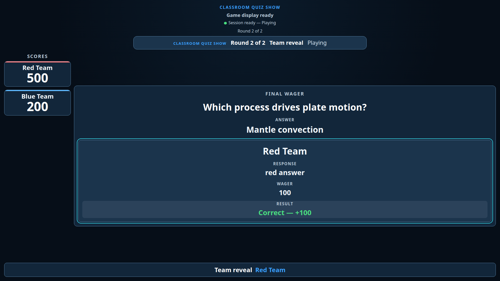

- **Screenshot:** `screenshots/final/audience-final-settlement-correct-1920x1080.png`
- **Role:** Audience
- **Class:** normal
- **Purpose:** Correct settlement wording + signed delta
- **Trigger / state:** Inject visualHistoryFinalSettlementCorrectSnapshot
- **Components:** `FinalWagerDisplay`
- **Route:** #/display
- **Privacy boundary:** public
- **UX principles:** P13, P14, P15, P17 (projector readability / causality)
- **Capture resolution:** 1920x1080
- **Capture method:** AUTOMATED-CAPTURE
- **Canonical code SHA:** `4368cc9eeb7dbf3ef342926e1d0fba7ba4c10f9b`
- **Milestone:** S05 complete / pre-owner-playthrough
- **Date:** 2026-09-24
- **Owner inspection:** required
- **Known limitations:** Browser Chromium capture; not Electron/Windows/projector/Sidecar evidence.

### `AUD-FINAL-SETTLE-INCORRECT` — Audience Final settlement incorrect

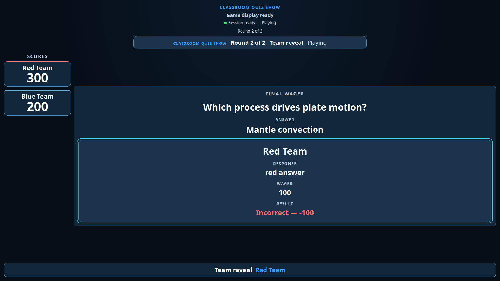

- **Screenshot:** `screenshots/final/audience-final-settlement-incorrect-1920x1080.png`
- **Role:** Audience
- **Class:** normal
- **Purpose:** Incorrect settlement wording + signed delta
- **Trigger / state:** Inject visualHistoryFinalSettlementIncorrectSnapshot
- **Components:** `FinalWagerDisplay`
- **Route:** #/display
- **Privacy boundary:** public
- **UX principles:** P13, P14, P15, P17 (projector readability / causality)
- **Capture resolution:** 1920x1080
- **Capture method:** AUTOMATED-CAPTURE
- **Canonical code SHA:** `4368cc9eeb7dbf3ef342926e1d0fba7ba4c10f9b`
- **Milestone:** S05 complete / pre-owner-playthrough
- **Date:** 2026-09-24
- **Owner inspection:** required
- **Known limitations:** Browser Chromium capture; not Electron/Windows/projector/Sidecar evidence.

### `AUD-FINAL-SETTLE-NO-RESPONSE` — Audience Final settlement no-response

- **Screenshot:** `screenshots/final/audience-final-settlement-no-response-1920x1080.png`
- **Role:** Audience
- **Class:** normal
- **Purpose:** No-response settlement wording
- **Trigger / state:** Inject visualHistoryFinalSettlementNoResponseSnapshot
- **Components:** `FinalWagerDisplay`
- **Route:** #/display
- **Privacy boundary:** public
- **UX principles:** P13, P14, P15, P17 (projector readability / causality)
- **Capture resolution:** 1920x1080
- **Capture method:** AUTOMATED-CAPTURE
- **Canonical code SHA:** `4368cc9eeb7dbf3ef342926e1d0fba7ba4c10f9b`
- **Milestone:** S05 complete / pre-owner-playthrough
- **Date:** 2026-09-24
- **Owner inspection:** required
- **Known limitations:** Browser Chromium capture; not Electron/Windows/projector/Sidecar evidence.

### `AUD-FINAL-RESOLUTION-LEADER` — Audience Final unique-leader resolution

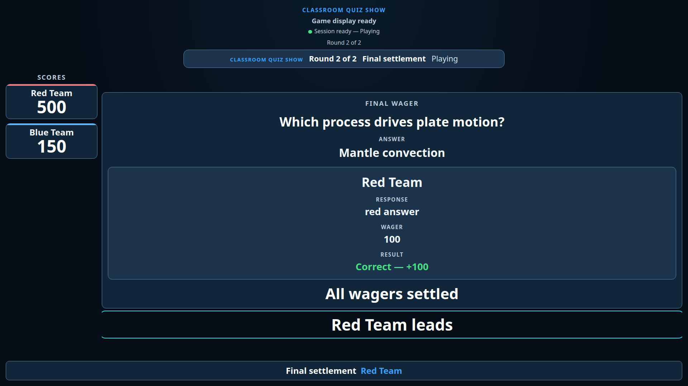

- **Screenshot:** `screenshots/final/audience-final-resolution-unique-leader-1920x1080.png`
- **Role:** Audience
- **Class:** normal
- **Purpose:** Leads / settled state — not winner until complete
- **Trigger / state:** Inject visualHistoryFinalResolutionUniqueLeaderSnapshot
- **Components:** `FinalWagerDisplay`
- **Route:** #/display
- **Privacy boundary:** public
- **UX principles:** P13, P14, P15, P17 (projector readability / causality)
- **Capture resolution:** 1920x1080
- **Capture method:** AUTOMATED-CAPTURE
- **Canonical code SHA:** `4368cc9eeb7dbf3ef342926e1d0fba7ba4c10f9b`
- **Milestone:** S05 complete / pre-owner-playthrough
- **Date:** 2026-09-24
- **Owner inspection:** required
- **Known limitations:** Browser Chromium capture; not Electron/Windows/projector/Sidecar evidence.

### `AUD-FINAL-RESOLUTION-TIED` — Audience Final tied resolution

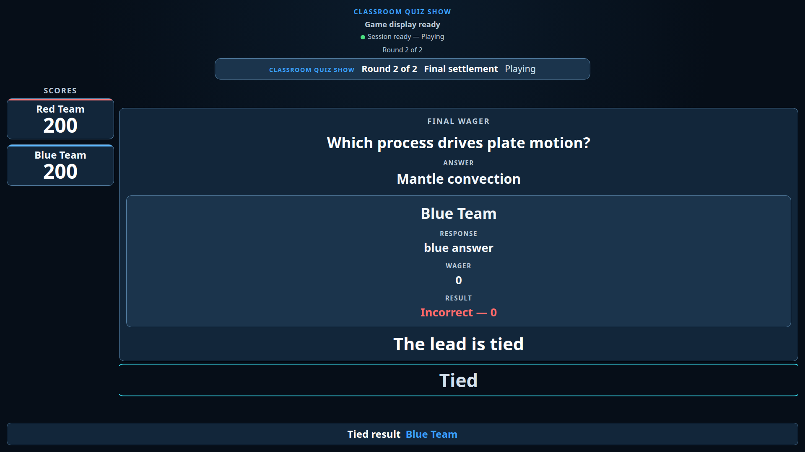

- **Screenshot:** `screenshots/final/audience-final-resolution-tied-1920x1080.png`
- **Role:** Audience
- **Class:** normal
- **Purpose:** Tied lead decision state without celebration
- **Trigger / state:** Inject visualHistoryFinalResolutionTiedSnapshot
- **Components:** `FinalWagerDisplay`
- **Route:** #/display
- **Privacy boundary:** public
- **UX principles:** P13, P14, P15, P17 (projector readability / causality)
- **Capture resolution:** 1920x1080
- **Capture method:** AUTOMATED-CAPTURE
- **Canonical code SHA:** `4368cc9eeb7dbf3ef342926e1d0fba7ba4c10f9b`
- **Milestone:** S05 complete / pre-owner-playthrough
- **Date:** 2026-09-24
- **Owner inspection:** required
- **Known limitations:** Browser Chromium capture; not Electron/Windows/projector/Sidecar evidence.

### `AUD-FINAL-SUDDEN-DEATH` — Audience Final sudden death

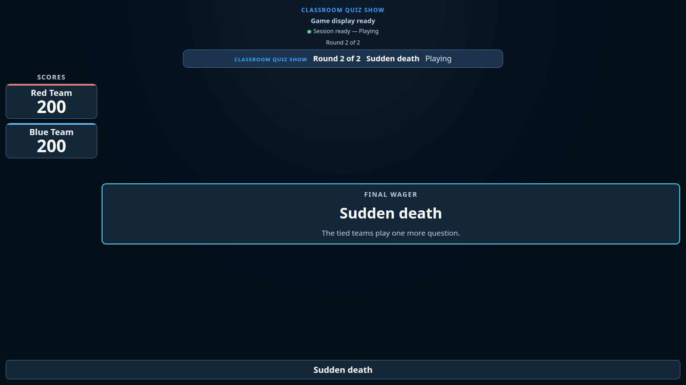

- **Screenshot:** `screenshots/final/audience-final-sudden-death-1920x1080.png`
- **Role:** Audience
- **Class:** normal
- **Purpose:** Neutral sudden-death panel
- **Trigger / state:** Inject visualHistoryFinalSuddenDeathSnapshot
- **Components:** `FinalWagerDisplay`
- **Route:** #/display
- **Privacy boundary:** public
- **UX principles:** P13, P14, P15, P17 (projector readability / causality)
- **Capture resolution:** 1920x1080
- **Capture method:** AUTOMATED-CAPTURE
- **Canonical code SHA:** `4368cc9eeb7dbf3ef342926e1d0fba7ba4c10f9b`
- **Milestone:** S05 complete / pre-owner-playthrough
- **Date:** 2026-09-24
- **Owner inspection:** required
- **Known limitations:** Browser Chromium capture; not Electron/Windows/projector/Sidecar evidence.

## Completion

### `AUD-COMPLETE-WINNER` — Audience completed unique winner

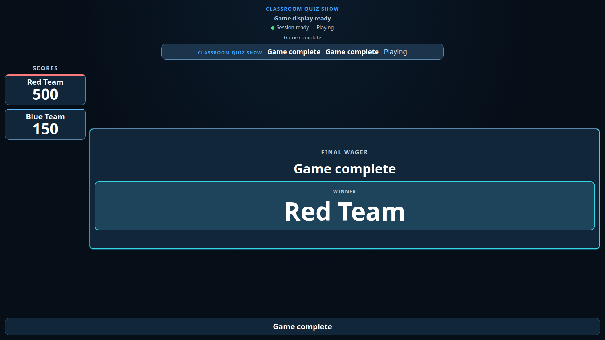

- **Screenshot:** `screenshots/completion/audience-final-complete-winner-1920x1080.png`
- **Role:** Audience
- **Class:** normal
- **Purpose:** Winner naming only after explicit game completion
- **Trigger / state:** Inject visualHistoryFinalCompleteWinnerSnapshot
- **Components:** `FinalWagerDisplay`
- **Route:** #/display
- **Privacy boundary:** public
- **UX principles:** P13, P14, P15, P17 (projector readability / causality)
- **Capture resolution:** 1920x1080
- **Capture method:** AUTOMATED-CAPTURE
- **Canonical code SHA:** `4368cc9eeb7dbf3ef342926e1d0fba7ba4c10f9b`
- **Milestone:** S05 complete / pre-owner-playthrough
- **Date:** 2026-09-24
- **Owner inspection:** required
- **Known limitations:** Browser Chromium capture; not Electron/Windows/projector/Sidecar evidence.

### `AUD-COMPLETE-TIED` — Audience completed tied finish

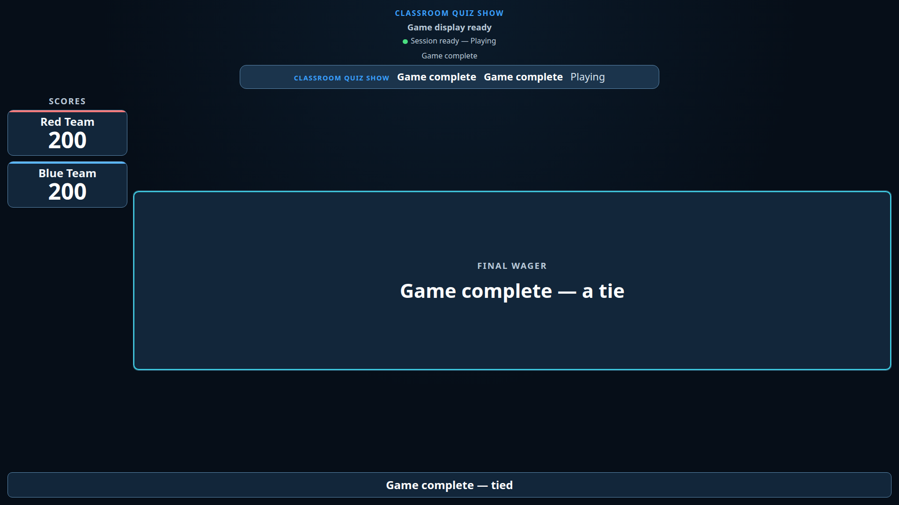

- **Screenshot:** `screenshots/completion/audience-final-complete-tied-1920x1080.png`
- **Role:** Audience
- **Class:** normal
- **Purpose:** Tied-finish completion without inventing a winner
- **Trigger / state:** Inject visualHistoryFinalCompleteTiedSnapshot
- **Components:** `FinalWagerDisplay`
- **Route:** #/display
- **Privacy boundary:** public
- **UX principles:** P13, P14, P15, P17 (projector readability / causality)
- **Capture resolution:** 1920x1080
- **Capture method:** AUTOMATED-CAPTURE
- **Canonical code SHA:** `4368cc9eeb7dbf3ef342926e1d0fba7ba4c10f9b`
- **Milestone:** S05 complete / pre-owner-playthrough
- **Date:** 2026-09-24
- **Owner inspection:** required
- **Known limitations:** Browser Chromium capture; not Electron/Windows/projector/Sidecar evidence.

### `AUD-COMPLETE-GENERIC` — Audience generic safe completion

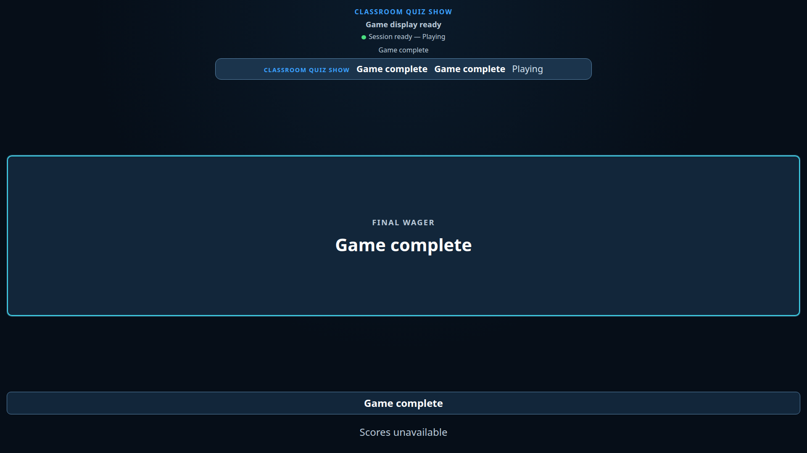

- **Screenshot:** `screenshots/completion/audience-final-complete-generic-safe-1920x1080.png`
- **Role:** Audience
- **Class:** recovery
- **Purpose:** Fail closed when unique winner cannot be publicly resolved
- **Trigger / state:** Inject visualHistoryFinalCompleteGenericSafeSnapshot
- **Components:** `FinalWagerDisplay`
- **Route:** #/display
- **Privacy boundary:** public
- **UX principles:** P13, P14, P15, P17 (projector readability / causality)
- **Capture resolution:** 1920x1080
- **Capture method:** AUTOMATED-CAPTURE
- **Canonical code SHA:** `4368cc9eeb7dbf3ef342926e1d0fba7ba4c10f9b`
- **Milestone:** S05 complete / pre-owner-playthrough
- **Date:** 2026-09-24
- **Owner inspection:** required
- **Known limitations:** Browser Chromium capture; not Electron/Windows/projector/Sidecar evidence.

## Recovery / degraded

### `AUD-RECOVERY-WAITING` — Audience waiting / reconnect

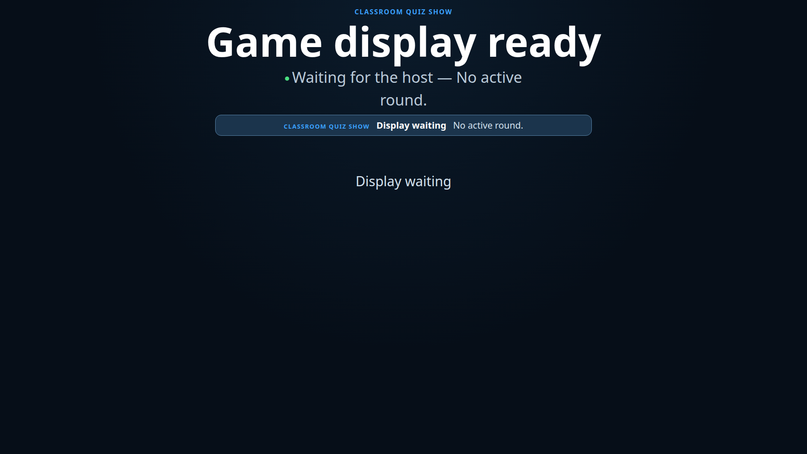

- **Screenshot:** `screenshots/recovery/audience-recovery-waiting-1920x1080.png`
- **Role:** Audience
- **Class:** recovery
- **Purpose:** Fail-closed Display before valid host publish
- **Trigger / state:** Open #/display with INITIAL_PUBLIC_STATE
- **Components:** `AudienceDisplayShell`, `NexusCore`
- **Route:** #/display
- **Privacy boundary:** public
- **UX principles:** P13, P14, P15, P17 (projector readability / causality)
- **Capture resolution:** 1920x1080
- **Capture method:** AUTOMATED-CAPTURE
- **Canonical code SHA:** `4368cc9eeb7dbf3ef342926e1d0fba7ba4c10f9b`
- **Milestone:** S05 complete / pre-owner-playthrough
- **Date:** 2026-09-24
- **Owner inspection:** required
- **Known limitations:** Browser Chromium capture; not Electron/Windows/projector/Sidecar evidence.

### `AUD-RECOVERY-SCORES-UNAVAILABLE` — Audience scores unavailable

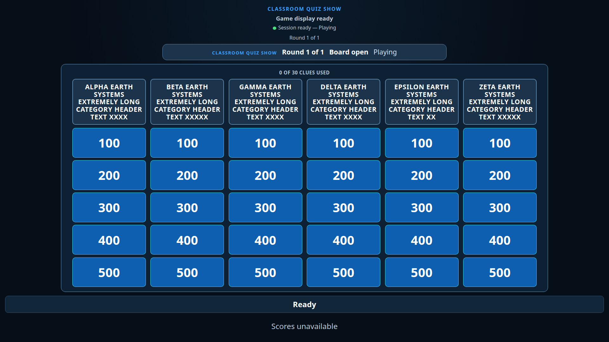

- **Screenshot:** `screenshots/recovery/audience-recovery-scores-unavailable-1920x1080.png`
- **Role:** Audience
- **Class:** recovery
- **Purpose:** Neutral Scores unavailable panel
- **Trigger / state:** Inject visualHistoryScoresUnavailableSnapshot
- **Components:** `ScoreLayout`, `TeamScoreboard`
- **Route:** #/display
- **Privacy boundary:** public
- **UX principles:** P13, P14, P15, P17 (projector readability / causality)
- **Capture resolution:** 1920x1080
- **Capture method:** AUTOMATED-CAPTURE
- **Canonical code SHA:** `4368cc9eeb7dbf3ef342926e1d0fba7ba4c10f9b`
- **Milestone:** S05 complete / pre-owner-playthrough
- **Date:** 2026-09-24
- **Owner inspection:** required
- **Known limitations:** Browser Chromium capture; not Electron/Windows/projector/Sidecar evidence.

### `AUD-RECOVERY-ROUND-UNAVAILABLE` — Audience round unavailable

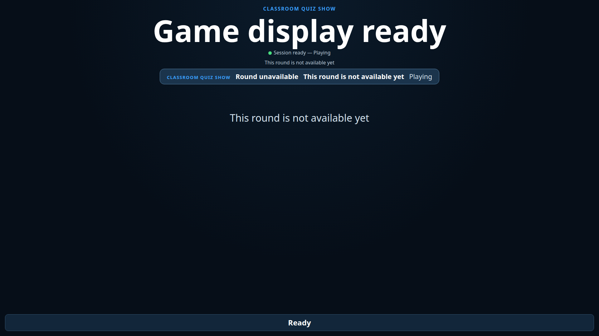

- **Screenshot:** `screenshots/recovery/audience-recovery-round-unavailable-1920x1080.png`
- **Role:** Audience
- **Class:** recovery
- **Purpose:** Neutral round unavailable fail-closed scene
- **Trigger / state:** Inject visualHistoryRoundUnavailableSnapshot
- **Components:** `AudienceDisplayShell`
- **Route:** #/display
- **Privacy boundary:** public
- **UX principles:** P13, P14, P15, P17 (projector readability / causality)
- **Capture resolution:** 1920x1080
- **Capture method:** AUTOMATED-CAPTURE
- **Canonical code SHA:** `4368cc9eeb7dbf3ef342926e1d0fba7ba4c10f9b`
- **Milestone:** S05 complete / pre-owner-playthrough
- **Date:** 2026-09-24
- **Owner inspection:** required
- **Known limitations:** Browser Chromium capture; not Electron/Windows/projector/Sidecar evidence.

### `S06-SLEEP-WAKE-AUDIO` — Sleep/wake, disconnect, classroom audio

- **Screenshot:** _pending — S06-DEFERRED_
- **Role:** Shared
- **Class:** recovery
- **Purpose:** Physical recovery and audio qualification
- **Trigger / state:** Authorized S06 hardware qualification
- **Components:** `audio cues`, `display placement`
- **Route:** _n/a_
- **Privacy boundary:** shared-teacher
- **UX principles:** P10, P11 (display recovery / fail-closed)
- **Capture resolution:** n/a
- **Capture method:** S06-DEFERRED
- **Canonical code SHA:** `4368cc9eeb7dbf3ef342926e1d0fba7ba4c10f9b`
- **Milestone:** S05 complete / pre-owner-playthrough
- **Date:** 2026-09-24
- **Owner inspection:** required
- **Known limitations:** Reserved for authorized S06; not part of this tranche.

## Stress / accessibility

### `AUD-BOARD-720P` — Audience board at 720p

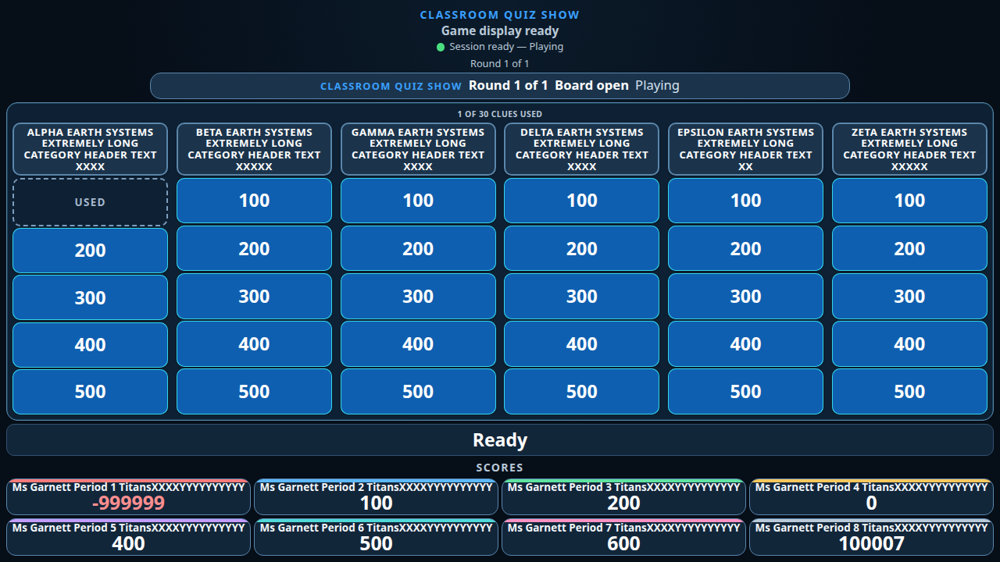

- **Screenshot:** `screenshots/stress/audience-board-partial-1280x720.png`
- **Role:** Audience
- **Class:** stress
- **Purpose:** Projector 720p geometry stress for the same partial board
- **Trigger / state:** Inject visualStressBoardSnapshot at 1280×720
- **Components:** `CategoryBoardDisplay`
- **Route:** #/display
- **Privacy boundary:** public
- **UX principles:** P13, P14, P15, P17 (projector readability / causality)
- **Capture resolution:** 1280x720
- **Capture method:** AUTOMATED-CAPTURE
- **Canonical code SHA:** `4368cc9eeb7dbf3ef342926e1d0fba7ba4c10f9b`
- **Milestone:** S05 complete / pre-owner-playthrough
- **Date:** 2026-09-24
- **Owner inspection:** required
- **Known limitations:** Browser Chromium capture; not Electron/Windows/projector/Sidecar evidence.

### `AUD-CLUE-PROMPT-LONG` — Audience long-prompt stress

- **Screenshot:** `screenshots/stress/audience-clue-prompt-longtext-1920x1080.png`
- **Role:** Audience
- **Class:** stress
- **Purpose:** Schema-max prompt readability with timer chrome
- **Trigger / state:** Inject visualStressLongPromptSnapshot
- **Components:** `CategoryBoardDisplay`, `SignalRail`
- **Route:** #/display
- **Privacy boundary:** public
- **UX principles:** P13, P14, P15, P17 (projector readability / causality)
- **Capture resolution:** 1920x1080
- **Capture method:** AUTOMATED-CAPTURE
- **Canonical code SHA:** `4368cc9eeb7dbf3ef342926e1d0fba7ba4c10f9b`
- **Milestone:** S05 complete / pre-owner-playthrough
- **Date:** 2026-09-24
- **Owner inspection:** required
- **Known limitations:** Browser Chromium capture; not Electron/Windows/projector/Sidecar evidence.

### `AUD-CLUE-IMAGE` — Audience image clue

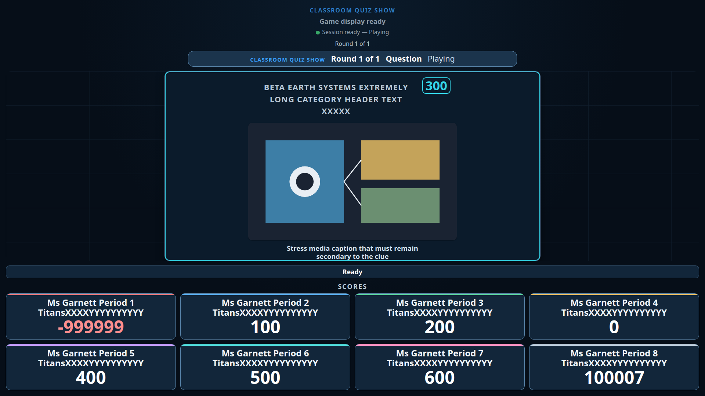

- **Screenshot:** `screenshots/stress/audience-clue-image-1920x1080.png`
- **Role:** Audience
- **Class:** stress
- **Purpose:** Media clue projector balance
- **Trigger / state:** Inject visualStressImagePromptSnapshot
- **Components:** `MediaContentDisplay`, `CategoryBoardDisplay`
- **Route:** #/display
- **Privacy boundary:** public
- **UX principles:** P13, P14, P15, P17 (projector readability / causality)
- **Capture resolution:** 1920x1080
- **Capture method:** AUTOMATED-CAPTURE
- **Canonical code SHA:** `4368cc9eeb7dbf3ef342926e1d0fba7ba4c10f9b`
- **Milestone:** S05 complete / pre-owner-playthrough
- **Date:** 2026-09-24
- **Owner inspection:** required
- **Known limitations:** Browser Chromium capture; not Electron/Windows/projector/Sidecar evidence.

### `AUD-HIGH-CONTRAST` — Audience high-contrast theme

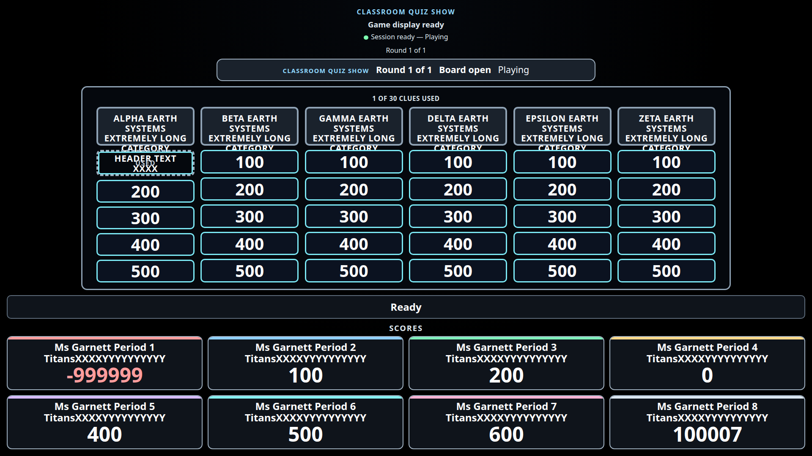

- **Screenshot:** `screenshots/stress/audience-board-high-contrast-1920x1080.png`
- **Role:** Audience
- **Class:** stress
- **Purpose:** Deterministic high-contrast theme on partial board
- **Trigger / state:** openDisplay(high-contrast) + visualStressBoardSnapshot
- **Components:** `ThemeProvider`, `CategoryBoardDisplay`
- **Route:** #/display?theme=high-contrast
- **Privacy boundary:** public
- **UX principles:** P13, P14, P15, P17 (projector readability / causality)
- **Capture resolution:** 1920x1080
- **Capture method:** AUTOMATED-CAPTURE
- **Canonical code SHA:** `4368cc9eeb7dbf3ef342926e1d0fba7ba4c10f9b`
- **Milestone:** S05 complete / pre-owner-playthrough
- **Date:** 2026-09-24
- **Owner inspection:** required
- **Known limitations:** Browser Chromium capture; not Electron/Windows/projector/Sidecar evidence.

### `AUD-REDUCED-MOTION` — Audience reduced motion

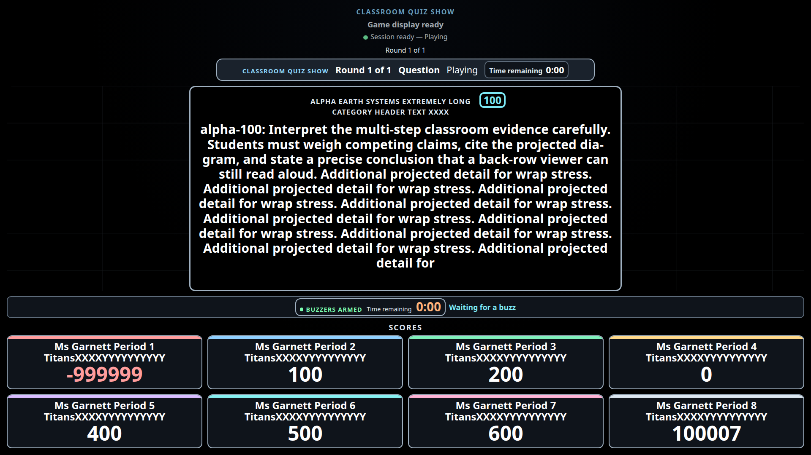

- **Screenshot:** `screenshots/stress/audience-clue-reduced-motion-1920x1080.png`
- **Role:** Audience
- **Class:** stress
- **Purpose:** prefers-reduced-motion presentation on armed clue
- **Trigger / state:** emulateMedia(reducedMotion) + armed buzz snapshot
- **Components:** `CategoryBoardDisplay`, `SignalRail`
- **Route:** #/display
- **Privacy boundary:** public
- **UX principles:** P13, P14, P15, P17 (projector readability / causality)
- **Capture resolution:** 1920x1080
- **Capture method:** AUTOMATED-CAPTURE
- **Canonical code SHA:** `4368cc9eeb7dbf3ef342926e1d0fba7ba4c10f9b`
- **Milestone:** S05 complete / pre-owner-playthrough
- **Date:** 2026-09-24
- **Owner inspection:** required
- **Known limitations:** Browser Chromium capture; not Electron/Windows/projector/Sidecar evidence.

### `S06-WINDOWS-PROJECTOR` — Windows teacher + classroom projector

- **Screenshot:** _pending — S06-DEFERRED_
- **Role:** Shared
- **Class:** edge
- **Purpose:** Actual classroom projector qualification
- **Trigger / state:** Authorized S06 hardware qualification
- **Components:** `Electron Display window`
- **Route:** _n/a_
- **Privacy boundary:** public
- **UX principles:** P10, P11 (display recovery / fail-closed)
- **Capture resolution:** n/a
- **Capture method:** S06-DEFERRED
- **Canonical code SHA:** `4368cc9eeb7dbf3ef342926e1d0fba7ba4c10f9b`
- **Milestone:** S05 complete / pre-owner-playthrough
- **Date:** 2026-09-24
- **Owner inspection:** required
- **Known limitations:** Reserved for authorized S06; not part of this tranche.

